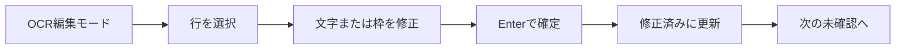
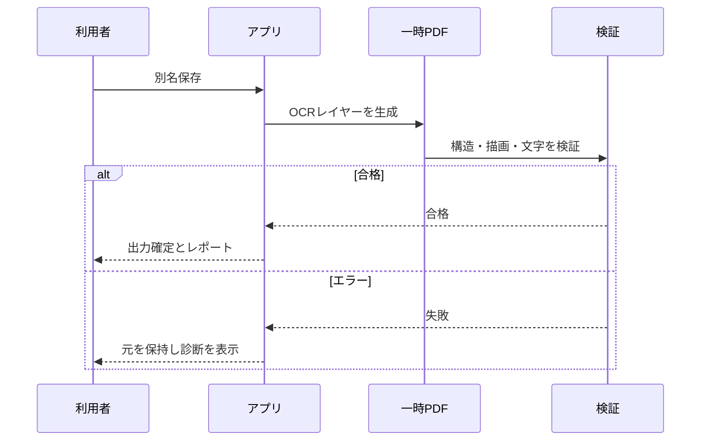

# 02-01 UX原則・操作フロー

## dev.157のスポイト・Delete・未選択時ホイール

1. 墨消しモードで「スポイトで取得」を選び、現在のPDFページ内の希望する色をクリックする。OCR枠や墨消し面の色ではなく、その下のページ画像の色を取得する。
2. 墨消し範囲を選択していた場合はその範囲の色を変更し、未選択の場合は次に作成する範囲の色を変更する。スポイトは1回で終了し、取得前のEscは変更せずに中止する。
3. 選択中の墨消し範囲は、ページ、一覧、操作ハンドルなど文字入力欄以外からDeleteで削除できる。色変更と削除はUndoで戻せる。入力欄内のDeleteは通常の文字編集を優先する。
4. OCR領域も墨消し範囲も選択していない状態でワークエリア上のホイールを回すと、どの編集モードでも文書表示を上下へスクロールする。Ctrl＋ホイールは倍率変更に使う。

採色は見えている編集用オーバーレイを対象にせず、PDFプレビュー画像と表示座標の対応から1画素を読む。ページ外や画像未準備時は色を変更せず、理由をステータスへ表示する。

## dev.156の墨消し範囲の色・表示・削除

1. 墨消しモードで、作成済み範囲の中面または右ペインの一覧を選択する。単純なクリックでも選択が成立し、ドラッグした場合はそのまま移動へ移る。
2. 色入力または黒・白・赤・青・緑・黄の候補を選ぶ。選択中の範囲があればその範囲を変更し、なければ次に追加する範囲の色を設定する。
3. 下の内容を確認しながら位置を合わせる場合は「半透明」、出力時の塗りに近い確認を行う場合は「不透明」を選ぶ。この選択は編集画面だけに作用し、出力PDFはどちらの場合も保存色で不透明にする。
4. 不要な範囲は「選択範囲を削除」、編集メニュー、または選択ハンドルにフォーカスした状態のDeleteで削除する。誤操作はUndoで復元できる。

中面の操作面は透明とし、黒い範囲の上へ白い部品を重ねない。色変更と削除は永続編集、半透明／不透明は一時表示として責務を分ける。

## dev.155の見開きページ切替

ページ切り替え方式の見開き表示で前／次ページへ移動するときは、現在の見開きを表示したまま、移動先ページと相方ページを準備する。両方の準備完了後に同じ画面更新内で差し替え、途中で単一ページ表示へ見える状態を作らない。表紙や末尾で相方が存在しない場合は、既存仕様どおりページ面を描かず背景だけを維持する。

準備中に別ページを選ぶ、文書を閉じる、単一／見開き、切り替え／連続、表紙、綴じ方向のいずれかを変更した場合は、古い準備処理を中止する。倍率、スクロール方式、OCR編集状態、プロジェクトの表示設定はページ切替だけでは変更しない。

## dev.154の墨消し範囲調整

1. 墨消しモードで、作成済みの半透明範囲をクリックまたはドラッグして選択する。
2. 範囲内をドラッグすると位置を移動する。選択中に表示される四辺・四隅のハンドルをドラッグすると、その方向へサイズを変更する。
3. ドラッグ中は画面上で結果を確認し、マウスを離した時点で1回の編集として確定する。Undo/Redoはドラッグ途中ではなく、確定前後の範囲を復元する。
4. Escで調整を中断した場合は保存済み範囲へ戻し、墨消しモード自体もOCR編集へ戻す。OCR編集では墨消し範囲が入力を受け取らず、OCR領域を通常どおり選択できる。

範囲は常にページ内へ収め、8px未満には縮小しない。選択ハンドルは墨消しを確定済みと示すものではなく、配布可能になるのは安全なPDF出力と再検証が完了した後である。

## dev.153のOCR編集／墨消しモード切替

1. 通常は「OCR編集」を選び、OCR領域の文字・位置・サイズ・回転等を編集する。
2. ツールバーの「墨消し」または編集モード一覧の「墨消し」を選ぶ。両方の選択表示と右ペインが同時に墨消しへ切り替わる。
3. ページ上をドラッグして範囲を指定する。追加後も墨消しモードを保つため、続けて別の範囲を指定できる。OCR編集で事前選択した文字・領域は右ペインの操作から範囲化できる。
4. OCR編集へ戻す場合はツールバーの「OCR編集」、編集モード一覧、またはEscキーを使う。

墨消し中はポインターを十字形にし、OCR領域の追加・削除・移動・変形・回転・整列・文字幅変更を受け付けない。右ペインは色、事前選択範囲の追加、現在ページの範囲一覧と解除だけを表示し、OCR入力欄を隠す。モードの見た目だけが切り替わって操作先が以前のまま残る状態を禁止する。

## dev.152の墨消し操作

1. OCR文字または領域を選び「選択範囲を墨消し」にするか、「矩形を追加」を選んでページ上をドラッグする。
2. 右プロパティで`#RRGGBB`色または色候補を選び、半透明表示で位置と範囲を確認する。範囲一覧から削除でき、誤操作はUndo/Redoする。
3. PDF出力を選ぶ。既存注釈・構造・ベクター情報が画像へ統合され、範囲に接する文字行は検索・コピーできなくなること、元PDFと編集プロジェクトには情報が残ることを確認する。
4. アプリは対象ページを高精細画像化して範囲を塗りつぶし、範囲外の不可視OCR文字だけを検索用に保持する。範囲内文字不在と再描画の検証に合格した別名PDFだけを確定する。

dev.153以降は墨消しモードそのものとOCR編集を排他的にし、処理中やPDF未読込時は開始できない。dev.154以降は作成済み範囲もページ上で移動・サイズ変更できる。画面上の色面やプロジェクト保存だけでは情報は消えていない。機密資料として配布するのは、検証済みの墨消し出力PDFだけとする。

## dev.149の文書連動表示とプロジェクト保存

PDF単体を開くときは、文書プロパティに記録された単一／見開き、ページ切り替え／連続スクロール、表紙位置、左右綴じを編集画面の最初の状態にする。指定がないPDFは単一ページ・L2Rとする。この適用だけで未保存表示を出してはならない。

利用者がツールバー、表示メニュー、設定画面から表示方法を変更した場合、以後はその組み合わせを現在のプロジェクト固有値として扱い、保存・自動保存・再読込で復元する。別のPDFへは引き継がない。文書プロパティの初期表示を後から変更した場合、プロジェクト固有値がまだなければ編集画面も追従し、既に上書きがある場合は利用者の表示を維持する。

## dev.148の編集プレビュー表示

ツールバーの「ページ配置」「スクロール方式」または［表示］→［ページ表示］から、単一ページ／見開きとページ切り替え／連続スクロールを独立して選ぶ。これは編集時の画面配置であり、文書プロパティのPDF初期表示設定そのものは変更しない。dev.149以降、意図的な選択内容はプロジェクトへ保存する。

連続スクロールでは、単一ページなら全ページ、見開きなら全見開きを先頭から末尾まで縦に並べる。見開きでは表紙の単独表示と左綴じ／右綴じを選ぶ。表紙の相手側と末尾の欠けた側は配置位置だけを確保し、白いページや枠を描かずキャンバス背景を見せる。OCR枠と操作ハンドルは現在ページにだけ表示し、周辺ページをクリックするとそのページが現在の編集面へ切り替わる。画面上の数値入力はページ切替前に確定する。

全ページには画像を持たない軽量な配置情報だけを用意する。表示範囲と前後1画面の周辺ページを必要時だけ別プロセスで描画し、単一／見開きのどちらでも補助画像は最大12ページに制限する。高速スクロール、配置・綴じ変更、文書変更で古い描画を中止し、全文書を1本の長い画像として作らない。連続表示の幅・高さ・ページ全体の自動倍率は現在の編集行を基準にする。左右ページ同時編集は今後の候補とする。

## dev.140の読み順表示、dev.139の保存方式表示とdev.133以降の追加操作

読み順編集では、番号バッジをOCR領域や選択枠とは別の最前面レイヤーに表示する。左上のサイズ変更ハンドルや隣接する領域の枠が重なっても番号を隠さず、バッジ自体はマウス入力を受け取らないため、従来の選択・ドラッグ操作を維持する。

アプリデータ保存モード（ポータブル／インストール）は設定の管理画面でだけ確認する。文書のプロパティとステータスバーには、現在のプロジェクトがPDFを内包する「ポータブルモード」か、外部PDFを参照する「通常モード」かを表示する。文書未読込時にはステータス表示を隠し、別名保存による方式変換後は即座に表示を更新する。

「プロジェクトを別名で保存」で保存先を指定した後、保存設定画面でポータブルモードまたは通常モードを選ぶ。新規PDFでは動作モードに応じた初期値を示すが、利用者が変更できる。上書き保存は現在の方式を維持する。通常モードでは通常の元PDFをコピーせず、プロジェクトからの相対位置を記録するため、両者の位置関係を維持する。埋め込みPDFからの変換または外部ページ挿入で作成した管理対象PDFだけを隣接`.assets`へ書き出す。削除・並べ替え・回転だけでは書き出さない。未参照の内容ハッシュPDFは現行と復旧用プロジェクトを確認した後に整理する。

右ペインの「文書注釈」から、現在の文書／ページ／選択OCR領域のコメントとタグを編集する。OCR領域を選択して「リンク設定」を開くと、移動先ページ、任意倍率、説明を設定できる。リンクのある領域はCtrl+クリックで移動し、「ページ」メニューまたは右ペインで戻る、進む、リンク先へ移動、削除を行う。通常クリックは従来どおり選択であり、ページ移動とは区別する。

PDF読込後、注意事項がある場合だけ右ペインに件数を表示する。「確認」から一覧を開き、検出項目、理由、分類を確認する。警告表示は元PDFを変更せず、検出できなかった特性の不存在を保証しない。

本書にはVersion 1.0の目標と現行dev.157までの操作説明が含まれる。実装範囲は[機能要求の実装状況](../01_Requirements/01-01_FunctionalRequirements.md)を参照し、下記の「現行」「既知不具合」を優先して現在の制約を確認する。

## 数値入力

位置、幅、高さ、回転角度、選択文字の送り幅はキーボードで増減できる。`↑/↓`は1、`Ctrl+↑/↓`は0.1、`Shift+↑/↓`は10を加減し、変更はUndo/Redo対象とする。

文字編集では、選択文字の進行方向側の終端に一定画面サイズのドラッグハンドルを表示する。横書きは右端、縦書きは下端を操作し、選択したUnicode文字要素の送り幅だけを変更する。他の文字の送り幅は維持し、後続文字の開始位置と行終端のみ再計算する。プレビュー上のOCR領域を通常クリックして選択する操作はスクロール位置を変更してはならない。画面内に一部だけ見えている領域も、現在の表示位置のまま編集できること。一方、校正対象一覧の選択や前後移動は、対象を画面内へ表示するため自動スクロールする明示的な移動操作である。

文字幅の復旧操作として、現在の行長を維持した等幅化と、OCR取込時の文字幅への復元を提供する。いずれもUndo/Redo対象とする。不均一幅の編集後に文字をクリックした場合、文字数による等分位置ではなく、各文字の累積送り幅を用いて対象文字を判定する。

文字編集では、通常クリックで単独選択、Ctrl+クリックで追加・解除、Shift+クリックでアンカーからの連続範囲を選択する。複数選択時の数値入力は共通送り幅を設定し、終端ハンドルのドラッグは各選択文字へ同じ差分を適用する。文字列の置換は単独選択時だけ許可する。選択・サイズ変更ハンドルは、拡大率に依存しない平面的な表示とする。

文字幅調整ハンドルは既定4画面ピクセル、55%不透明の細い平面表示とする。OCRオーバーレイと各編集ハンドルの色、不透明度、大きさは設定画面で変更でき、保存直後に現在のプレビューへ反映する。

未保存変更を持つウィンドウを閉じる場合は、保存、破棄、キャンセルを確認する。入力中の値を確定してから未保存判定を行い、保存失敗または保存先選択のキャンセル時は終了を中止する。

dev.123では同じ画面で別PDF/プロジェクトを開く場合にも入力を確定して保存・破棄・キャンセルを確認する。保存の取消・失敗時は切替を中止する。新しい文書の検証・初期描画に失敗した場合も、元の文書・編集・Undoを保持する。

dev.129ではページ追加・削除・並べ替え・90度回転をCtrl+Z／Ctrl+Yで取り消し・再実行できる。dev.143では削除・並べ替え・回転を固定ページID付きの論理ページ列として保持し、操作やUndo/RedoのたびにPDFを複製しない。復元対象は論理ページ列、OCRページ、しおり、表示ページ、ページ複数選択であり、元PDFは変更しない。外部ページ追加だけは複数PDFを統合する境界として一時PDFを作る。ページ削除の確認画面にもUndo可能であることを表示する。

dev.142ではページ編集用PDFを現在PDF込みで最大12ファイル・合計1 GiBへ制限する。上限に達した場合は、共有Undo時系列の途中を飛ばさず古い側を整理し、未参照PDFを直ちに削除する。現在の操作は完了させ、ステータス欄で古い履歴を整理したことを通知する。容量管理のための常設UIは増やさない。

dev.143では通常の削除・並べ替え・回転が作業PDFを作らなくなったため、この上限は外部ページ挿入で物理PDFを必要とする履歴の安全網として残す。サムネイルは現在ページの前後32ページだけを遅延生成し、遠方へ移動したときは新しい周辺へ読み替える。

## 1. ワークスペース

### 最近開いたファイル（dev.128の追加）

「ファイル → 最近開いたファイル」から成功した読込順にPDF/プロジェクトを再度開ける。未保存時の保存・破棄・キャンセルと読込失敗時の保全は通常の「開く」と共通。ファイル名とフォルダーを表示し、長いパスは省略表示と完全パスのツールチップを組み合わせる。未読込でも履歴があれば有効、処理中は無効。存在しないファイルはエラーを表示して履歴に残す。

「設定 → 管理」で表示件数（10件既定、0～30件）と履歴クリアを扱う。0件は表示・記録停止、クリアは確認後の「保存」で確定し「キャンセル」で取り消す。最大30件の内部保持と表示件数を区別する。共通の入力・ボタン・タブスタイル、Count=CとHistory=Hのアクセスキー、表示件数からクリアへのTab順序に従う。履歴と移出入設定の分離は[操作ガイド](../../../../RECENT-FILES.md)を参照。

### 配置プリセット

以下は目標ワークスペース設計である。dev.127では左ページ一覧・右プロパティの幅と表示、ステータスバーとサムネイルの表示を、名前付きプリセット（最大20件）として保存・切替できる。「編集 → 設定 → 管理」で操作し、登録・適用・削除は設定画面の「保存」で確定する。ドッキング、フロート、画面外パネル回収や、下表の目標パネル一式は未実装である。[対象範囲と手順](../../../../SETTINGS-WORKSPACES.md)を参照。

| プリセット | 主なパネル |
|---|---|
| 基本 | ページ、PDF表示、簡易プロパティ |
| OCR編集 | OCR一覧、文字・配置、差分、状態 |
| 読み順編集 | 読み順ツリー、番号オーバーレイ、ルビ |
| 校正・レビュー | コメント、ブックマーク、検索候補、差分 |
| PDF検証 | 検証結果、ログ、PDF情報 |
| カスタム | 利用者保存レイアウト |

パネルはドッキング、フロート、非表示、再配置できる。画面外に出たパネルは起動時に回収する。

## 2. OCR修正の標準フロー

- クリック: 行選択
- Ctrl+クリック: 複数選択
- ダブルクリック: 段落選択（モックレビューで最終確定）
- 枠内ドラッグ: 移動
- 端ハンドル: 行長または高さ
- 四隅: 幅・高さ
- 回転ハンドル: 回転
- 矢印: 微移動、Shift+矢印: 大移動
- Esc: キャンセルまたは選択解除

右側の確認ステータスは、現在の行、段落、または複数選択全体へ適用する。文字列や配置を編集した領域は自動的に「修正済み」とし、利用者が「確認済み」「要再確認」「OCR対象外」「保留」などへ明示的に変更できる。ステータス変更もUndo/Redo対象とする。

### 2.1 現行の校正・確認フロー（dev.123）

1. ツールバーのモードを「校正・確認」にする。開始時は行編集になり、領域追加の待機状態は解除される。必要に応じて編集単位は切り替えられる。
2. 右側の対象一覧から領域を選ぶ。既定では「未確認・要再確認」のみを現在ページの読み順で表示する。絞り込みは「未確認」「要再確認」「すべてのステータス」に変更できる。削除済み領域は対象外で、対象外の通常オーバーレイは比較用に表示を維持する。
3. 原画像と文字を見比べ、必要なら文字列・単語の読み・確認ステータスを編集する。文字修正は「修正済み」になり、現在のフィルターに合わなくなると一覧から外れるが、編集欄は維持される。
4. 選択した1領域の確認が終わったら「確認済みにして次へ」を押す。状態を「確認済み」にして次候補へ進む。状態を変えずに移動したい場合は「前の対象」「次の対象」を使う。
5. 確認済み・修正済み・OCR対象外・保留を再度開く場合は「すべてのステータス」を選ぶ。状態変更や文字編集はUndo/Redoでき、状態を戻すと一覧の対象判定も更新される。
6. プロジェクトを保存する。レビュー状態と文字修正は保存対象だが、現在のモードと対象フィルターは一時的なUI状態であり保存しない。空文字編集と既存領域属性も保持する。

対象一覧と件数は現在ページのみである。「前の対象」「次の対象」は必要なページを遅延読込し、ページ順、同じページ内では読み順で検索する。現在ページの対象が0件でも別ページを検索できる。先頭・末尾に達した場合は案内して停止し、反対側へ循環しない。文書全体や段落単位の進捗集計はまだない。

検索中は進捗表示と「検索を中止」を表示する。モード、フィルター、ページ、文書の変更やプレビューでの手動選択でも進行中の対象検索を中止する。対象一覧や前後移動で選んだ領域は画面内へスクロールするが、プレビュー上の枠を通常クリックしただけなら表示位置を維持する。

通常の枠移動、サイズ変更、回転、整列、文字幅変更、領域追加・削除、分割・結合は校正中に無効にする。元の領域ロック設定は書き換えない。直接配置を調整する場合はOCR編集へ戻る。文字の挿入・削除に伴う文字セルの配置再計算は通常どおり行う。

### 2.2 dev.123で修正した制限漏れと保存

OCR品質分析のキーワード幅補正は、校正中にボタンを無効化し、実行処理でも拒否する。全置換後は「要再確認」となり既定の対象一覧に残る。通常の個別修正は従来どおり「修正済み」である。

空欄にしたOCR文字は空欄のまま保存・再読込し、PDF出力では元のテキストを除去する。既存の親領域・補正方式・出力属性も保持する。コメントとタグはdev.133で対象別編集を実装した。差分、監査履歴、階層別集計は未実装である。

自動保存は指定間隔に加えて操作停止約30秒後にも行う（5秒ごとの判定）。通常保存前のプロジェクトは作業フォルダーの`recovery`へ元PDFを内包して保存する。復旧は該当`.autosave.pdfocrproj`を明示的に開く。起動時の自動候補提示は未実装で、自動保存しても未保存表示は解除しない。

## 3. 読み順編集

現行dev.140では領域番号を常に選択枠・編集ハンドルより手前に表示し、選択した領域を1つ前／後へ移動する操作と、ページ内位置からの再計算で順序を編集する。位置、文字方向、読み順は独立する。番号バッジは倍率にかかわらず一定の画面サイズを保ち、不透明な背景と白い輪郭で原稿画像上でも判読可能とする。

ドラッグによる順序変更、直接番号入力、階層ツリー、自動推定の提案表示は目標仕様であり未実装である。将来の自動推定は提案として表示し、手動変更を上書きしない。

## 4. 検索置換

候補確認では、該当画像、前後の文脈、ページ、方向、状態を同時表示する。操作は「置換」「スキップ」「すべて置換」「中止」。全置換前には件数と対象範囲を確認し、実行後は要再確認にする。

上記には目標の候補表示を含む。検索・逐次置換・全置換は実装済みで、dev.123では全置換後の状態を要求どおり「要再確認」に修正した。

## 5. 保存

## 6. 初心者と上級者

- 初回は基本ワークスペース、ガイド付きプロジェクト作成を表示する。
- PDF演算子、変換行列、フォントコード等は詳細表示に置く。
- 危険操作は結果と復元方法を示すが、確認ダイアログを乱用しない。
- 目標仕様では、コマンドパレットからすべての主要コマンドを検索できる。現行実装にコマンドパレットはない。

## 7. ショートカット方針

- Acrobatに近い既定値を採用するが、商標・完全互換をうたわない。
- Ctrl+Z/Ctrl+Y、検索、保存、ズーム、ページ移動など一般的操作を優先する。
- コマンド単位で複数割当、コンテキスト、競合検出、プリセット、インポート・エクスポートを持つ。
- テキスト入力中はアプリコマンドとの衝突を抑止する。

dev.125の実装済みキーボード操作は[操作ガイド](../../../../KEYBOARD-ACCESSIBILITY.md)を参照する。入力ラベルのAltアクセスキー、ダイアログのボタン／タブ／メニューのアクセスキー、下部操作行を後にするTab順序、F6／Shift+F6の主要領域移動を提供する。OK・キャンセルにはアクセスキーを追加しない。8種類の変更可能なショートカットは、保存後の値・解除・予約キーとの競合をツールチップへ反映する。ドロップダウンのAlt+Up／Downと入力欄のTab／Esc／Enterを奪わない。全アイコンへの独立したAltキーではなく、メニュー・ツールバー内のキー移動を併用する。前節の複数割当・プリセット・移出入は将来仕様であり未実装である。

dev.126では表示順の連番を廃し、Open=O、Save=S、Save As=Aなど英語の操作名を基準に割り当てを見直した。主要操作を優先し、重複時は同じ単語内の別の文字を使う。意味のない数字で埋めず、関連する補助入力はグループ内のTab移動を併用する。メニューのアクセスキーはメニューを開いてから使用する（例：Alt+F → O）。日英でキーを変えず、設定済みの編集ショートカットは変更しない。

dev.127では設定全体のJSON移出入に8種類の編集ショートカットを含めた。取り込みで予約キーや重複を拒否し、設定保存後は既存ツールチップへ反映する。前述のdev.125時点の未実装記述のうち、設定の移出入はこの改訂で解消した。1コマンドへの複数割り当て・ショートカット専用プリセットは未実装のまま。管理タブはManaGeのGとし、他タブの入力・チェックボックスのキーと重ならないようにした。

## 8. エラー表示

エラーは「何が起きたか」「データは安全か」「次にできること」「詳細ID」を示す。重大な保存エラーはモーダル、軽微な検証警告はパネルと通知で示す。
