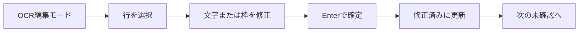
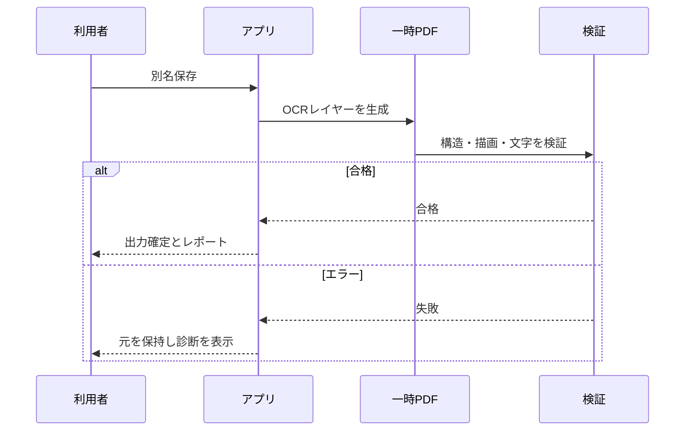

# 02-01 UX原則・操作フロー

## 数値入力

位置、幅、高さ、回転角度、選択文字の送り幅はキーボードで増減できる。`↑/↓`は1、`Ctrl+↑/↓`は0.1、`Shift+↑/↓`は10を加減し、変更はUndo/Redo対象とする。

文字編集では、選択文字の進行方向側の終端に一定画面サイズのドラッグハンドルを表示する。横書きは右端、縦書きは下端を操作し、選択したUnicode文字要素の送り幅だけを変更する。他の文字の送り幅は維持し、後続文字の開始位置と行終端のみ再計算する。OCR領域の選択操作はプレビューのスクロール位置を変更してはならない。画面内に一部だけ見えている領域も、現在の表示位置のまま編集できること。

文字幅の復旧操作として、現在の行長を維持した等幅化と、OCR取込時の文字幅への復元を提供する。いずれもUndo/Redo対象とする。不均一幅の編集後に文字をクリックした場合、文字数による等分位置ではなく、各文字の累積送り幅を用いて対象文字を判定する。

文字編集では、通常クリックで単独選択、Ctrl+クリックで追加・解除、Shift+クリックでアンカーからの連続範囲を選択する。複数選択時の数値入力は共通送り幅を設定し、終端ハンドルのドラッグは各選択文字へ同じ差分を適用する。文字列の置換は単独選択時だけ許可する。選択・サイズ変更ハンドルは、拡大率に依存しない平面的な表示とする。

文字幅調整ハンドルは既定4画面ピクセル、55%不透明の細い平面表示とする。OCRオーバーレイと各編集ハンドルの色、不透明度、大きさは設定画面で変更でき、保存直後に現在のプレビューへ反映する。

未保存変更を持つウィンドウを閉じる場合は、保存、破棄、キャンセルを確認する。入力中の値を確定してから未保存判定を行い、保存失敗または保存先選択のキャンセル時は終了を中止する。

## 1. ワークスペース

以下は目標ワークスペース設計である。現行dev.122は左ページ一覧、中央プレビュー、右プロパティ、下部ステータス等の表示切替と幅設定を提供するが、ドッキング、フロート、利用者保存プリセット、画面外パネル回収は未実装である。

| プリセット | 主なパネル |
|---|---|
| 基本 | ページ、PDF表示、簡易プロパティ |
| OCR編集 | OCR一覧、文字・配置、差分、状態 |
| 読み順編集 | 読み順ツリー、番号オーバーレイ、ルビ |
| 校正・レビュー | コメント、ブックマーク、検索候補、差分 |
| PDF検証 | 検証結果、ログ、PDF情報 |
| カスタム | 利用者保存レイアウト |

パネルはドッキング、フロート、非表示、再配置できる。画面外に出たパネルは起動時に回収する。

## 2. OCR修正の標準フロー

- クリック: 行選択
- Ctrl+クリック: 複数選択
- ダブルクリック: 段落選択（モックレビューで最終確定）
- 枠内ドラッグ: 移動
- 端ハンドル: 行長または高さ
- 四隅: 幅・高さ
- 回転ハンドル: 回転
- 矢印: 微移動、Shift+矢印: 大移動
- Esc: キャンセルまたは選択解除

右側の確認ステータスは、現在の行、段落、または複数選択全体へ適用する。文字列や配置を編集した領域は自動的に「修正済み」とし、利用者が「確認済み」「要再確認」「OCR対象外」「保留」などへ明示的に変更できる。ステータス変更もUndo/Redo対象とする。

## 3. 読み順編集

領域番号を表示し、ドラッグ、直接番号入力、ツリー操作で順序を編集する。位置、文字方向、読み順は独立する。自動推定は提案として表示し、手動変更を上書きしない。

## 4. 検索置換

候補確認では、該当画像、前後の文脈、ページ、方向、状態を同時表示する。操作は「置換」「スキップ」「すべて置換」「中止」。全置換前には件数と対象範囲を確認し、実行後は要再確認にする。

## 5. 保存

## 6. 初心者と上級者

- 初回は基本ワークスペース、ガイド付きプロジェクト作成を表示する。
- PDF演算子、変換行列、フォントコード等は詳細表示に置く。
- 危険操作は結果と復元方法を示すが、確認ダイアログを乱用しない。
- 目標仕様では、コマンドパレットからすべての主要コマンドを検索できる。現行実装にコマンドパレットはない。

## 7. ショートカット方針

- Acrobatに近い既定値を採用するが、商標・完全互換をうたわない。
- Ctrl+Z/Ctrl+Y、検索、保存、ズーム、ページ移動など一般的操作を優先する。
- コマンド単位で複数割当、コンテキスト、競合検出、プリセット、インポート・エクスポートを持つ。
- テキスト入力中はアプリコマンドとの衝突を抑止する。

## 8. エラー表示

エラーは「何が起きたか」「データは安全か」「次にできること」「詳細ID」を示す。重大な保存エラーはモーダル、軽微な検証警告はパネルと通知で示す。
