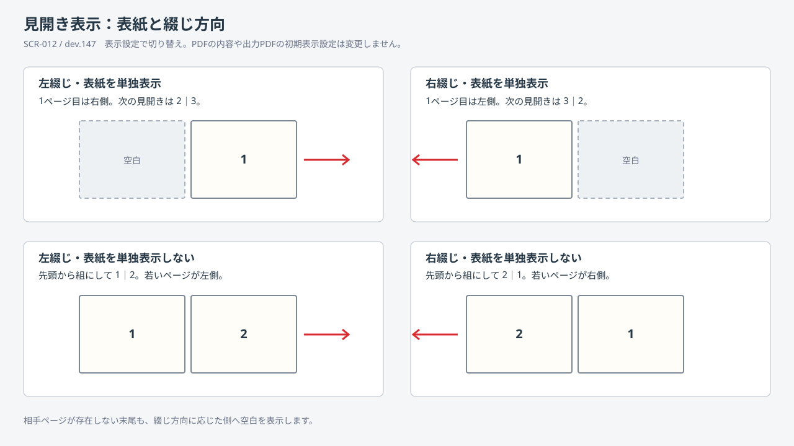

# 03-01 画面設計

## dev.163の墨消し入力方法（2026-09-15）

- 墨消しプロパティの先頭に「入力方法」一覧を置き、矩形／PDF文字を選択／多角形／フリーハンドを選択する。Alt+Mで一覧へ移動できる。
- 多角形とフリーハンドの未確定輪郭は点線で表示し、確定済みの輪郭は保存色と選択枠を表示する。外接枠の中を一律に塗らず、実輪郭だけを塗る。
- PDF文字選択で該当文字がない場合は空の墨消しを作らず、ステータスで理由を示す。
- 既存の色、スポイト、表示濃度、一覧、削除操作は入力方法に依存せず共通利用する。

## dev.157の墨消し採色・Delete・ホイール操作（2026-09-13）

図: [墨消しのスポイト・Delete・未選択時ホイール](../../assets/svg/SCR-017_RedactionEyedropperAndWheel-dev157.svg)

- 墨消しプロパティの標準色候補の下に「スポイトで取得」を置く。アクセスキーはAlt+I、ツールチップは現在ページをクリックして色を取得することを説明する。取得待ちはボタンの選択状態と十字ポインターで示し、1回の取得またはEscで解除する。
- スポイトは現在の編集ページ内だけを対象とし、ページ外、画像未準備、寸法不成立では色を変更しない。取得した色は`#RRGGBB`で色入力へ反映する。
- 選択中の墨消しは、文字入力欄以外からDeleteで削除できる。削除後は選択を解除し、Undoで復元できる。入力欄では文字削除を優先する。
- 未選択時の通常ホイールは中央ワークエリアをスクロールする。Ctrl＋ホイールの倍率変更、および入力部品固有のホイール操作とは競合させない。

## dev.156の墨消し範囲の色・表示・削除（2026-09-13）

図: [墨消し範囲の色・表示・削除](../../assets/svg/SCR-016_RedactionAppearance-dev156.svg)

- ページ上の範囲をクリックするか、右ペインの現在ページ一覧を選ぶと、その範囲が選択状態になる。選択後の色入力と色候補は既存範囲へ即時反映し、Undo/Redoの1操作として記録する。未選択時は新規範囲の既定色を設定する。
- 「編集画面での表示」に「半透明」「不透明」を置く。半透明を既定とし、不透明は保存色をそのまま確認する。表示濃度は編集面だけの状態で、プロジェクト保存やPDF出力の不透明度には使わない。
- 範囲の中面を覆う移動用Thumbは透明テンプレートとし、既定部品の白背景を描かない。塗りは背面の墨消し表示だけが担当する。
- 右ペインの操作名は「選択範囲を削除」とし、編集メニューにも同じ個別削除を置く。削除はUndoで復元可能であることをツールチップに示す。

## dev.155の見開きページ切替（2026-09-13）

- ページ切り替え方式の見開き表示で前／次ページへ移動するときは、移動先の編集ページと相方ページを先に描画する。準備中は現在の完全な見開きを維持し、準備完了後に2つの表示枠を同じ画面更新内で置き換えるため、単一ページ表示へ一時的に切り替わって見えない。
- 準備中にページ選択、文書、単一／見開き、切り替え／連続、表紙、綴じ方向が変わった場合は、古い準備を取り消す。表紙または末尾に相方がない場合は従来どおりページ面を描かず、背景だけを表示する。

## dev.149の初回表示と表示状態保存（2026-09-12）

- PDF単体を開いた最初の画面は、文書プロパティの`PageLayout`と`Direction`をページ配置、スクロール方式、表紙、綴じ方向へ変換して表示する。指定がない場合は単一ページ・ページ切り替え・左綴じとする。
- ツールバー、表示メニュー、設定画面で利用者が変更した4項目は現在のプロジェクト固有表示として保存し、再読込時に文書の指定より優先する。初回状態を表示するだけでは保存要求を出さない。
- 文書のプロパティの「ページレイアウト」は1ページ、連続ページ、見開き、連続見開きを選択できる。連続見開きも既存の表紙・綴じ方向欄を使用する。新しい画面部品や配置変更はないため、見開き配置図はdev.147版を継続使用する。

## dev.148の編集プレビュー表示切替（2026-09-11）

- メインツールバーの「ページ配置」（Alt+N）と「スクロール方式」（Alt+2）、または［表示］→［ページ表示］から、単一ページ／見開きとページ切り替え／連続スクロールを独立して選ぶ。PDF未読込時は無効とする。
- 単一ページは現在ページの編集面だけを表示する。連続ページは先頭から末尾までを縦に並べ、スクロールバー、ホイール、タッチパッド等で切れ目なく移動できる。任意ページをクリックすると表示位置を保って、そのページがOCR操作可能な現在編集面になる。ページ一覧、前後ボタン等による明示的な移動は対象ページを画面内へ表示する。
- 見開き表示中は［表示］→［ページ表示］→［見開き表示の設定］を有効にし、「表紙を単独表示」、左綴じ、右綴じを変更できる。表紙の有無はAlt+C、左綴じはAlt+L、右綴じはAlt+R。設定画面の「表示」タブにも同じ設定を置き、1ページ目の単独表示はAlt+1、綴じ方向はAlt+J（綴じ／join）で操作する。
- 左綴じは組の若いページを左、右綴じは若いページを右へ置く。表紙を単独表示する場合、1ページ目は左綴じで右、右綴じで左へ配置する。先頭・末尾で相手ページがない側は位置だけ確保し、白いページ面・枠線・影は表示しない。同じ見開きに相手ページが存在するときだけ周辺画像を遅延描画し、クリックで編集対象を切り替える。
- 周辺画像は閲覧と移動に限定し、OCR枠、選択ハンドル、読み順番号は現在ページの編集面へだけ表示する。全ページ分の軽量枠は持つが、画像化するのは表示範囲と前後1画面に限定する。画像は最大12ページをLRU方式で保持し、高速スクロール、モード変更、文書変更で古い描画を取り消す。
- dev.148ではページ配置、スクロール方式、表紙の扱い、綴じ方向をアプリ設定へ保存していた。旧「連続ページ」設定は単一ページ＋連続スクロールへ移行する。dev.149では上記の文書初期値・プロジェクト固有値へ変更した。
- 幅・高さ・ページ全体へのフィットは、単一／連続では現在の編集ページ、見開きでは表示中の見開き全体を基準にする。連続表示で文書全長を高さへ収めることはしない。手動倍率は表示切替後も維持する。

## dev.143の論理ページ編集（2026-09-10）

削除・並べ替え・90度回転は、元PDFを複製せず論理ページ列とOCR座標を更新する。画面の操作、選択、Undo/Redo表示は従来どおりとし、プレビューとサムネイルは論理順・論理回転を反映する。サムネイルは現在ページの前後32ページだけを遅延生成し、離れたページへの移動時に周辺を読み替える。

## dev.142のページ履歴容量制限（履歴）

ページ編集用PDFは自動的に最大12ファイル・合計1 GiBへ制限する。上限で古いUndo履歴を整理した場合は、操作完了メッセージにその旨を付記する。新しい設定項目や常設表示は追加せず、通常操作の画面占有と設定の複雑化を避ける。ページ編集、Undo/Redo、保存の操作配置は変更しないため、画面図の改訂は不要である。

## dev.141のOCR描画負荷対策（2026-09-10）

文字ごとの画面部品を生成せず、1つのOCR領域を1つの描画レイヤーへまとめる。Unicode文字ごとの位置と送り幅、選択・ロック・検索一致の表示、倍率に応じた境界線、縦書き、読み順番号の最前面表示は維持する。領域サイズ変更用の8個のハンドルは、行／段落編集で選択中の領域にだけ生成する。選択解除、文字編集、校正・確認モードでは解放する。部品配置や操作は変更しないため画面模式図の改訂は不要。設計と検証方法は[OCR描画の軽量化](../../../../OCR-RENDERING.md)を参照する。

## dev.140で修正した読み順表示とdev.139以前の追加画面・部品

図: [プロジェクト保存・入力注意・コメント／タグ・ページリンク](../../assets/svg/SCR-011_ProjectAnnotations-dev133.svg)

- メイン画面右ペインに入力PDF注意バナーと「文書注釈」を追加する。文書注釈はコメント／タグ、リンク設定、戻る／進む／リンク先／削除を提供する。メニューからも同じ操作へ到達できる。
- プロジェクト保存設定画面は、別名保存先の指定後にポータブルモードと通常モードを選択する。選択肢ごとに移動・共有時の扱いを説明し、Alt+P／Alt+N、Tab移動、Enterで保存、Escでキャンセルできる。最大化・最小化は提供しない。
- コメント／タグ画面は対象名、コメント一覧、本文、重要度、タグ、解決状態を編集する。
- ページリンク画面は移動先ページ、任意倍率、説明を編集する。入力PDF注意画面はコード・重要度・見出し・説明・分類を一覧表示する。
- 追加画面も共通入力／ボタン様式、意味に基づくアクセスキー、Tab順序、Enter/Esc動作を使用する。
- 読み順編集の番号バッジは、PDF画像、OCR領域、選択枠、サイズ変更・回転ハンドルとは独立した最前面レイヤーへ描画する。バッジは入力を受け取らず、下にある領域の選択やドラッグを妨げない。不透明な背景と白い輪郭を使い、左上ハンドルや隣接領域の枠が重なっても番号を判読できるようにする。

## 現行画面と目標画面の区別（2026-08-30 / dev.123）

既存ワイヤーフレームと各画面の構成案はVersion 1.0の目標を含む。次の「現行実装」および設定画面の実装説明を、現在利用できる範囲として読む。

| 画面 | 現行実装と残る範囲 |
|---|---|
| メイン・OCR編集 | ページ/しおり、プレビュー、右プロパティ、状態編集、対象別コメント／タグ、OCR領域のページリンクを提供。補正方式・出力属性の専用UI、差分等は未実装 |
| 読み順編集 | 選択枠より前面の番号表示と読み順編集を提供。目標の階層ツリー・ルビ関連付け等がすべて揃った画面ではない |
| 検索・置換 | 検索、逐次置換、全置換を提供。目標の候補確認・条件指定の全項目は未完了 |
| 保存・検証 | 別名PDF出力、確定前検証、ポータブルモード／通常モードのプロジェクト保存選択、限定的な入力特性注意を提供。完全な適合性／署名検証マトリクスは未完了 |
| プロジェクト作成・診断修復 | PDF/プロジェクト読込、保存、検証、バックアップ復元は利用可能。作成ウィザードと分類型の修復・救出画面は未実装 |
| 校正・確認 | 現在ページの対象一覧・状態フィルター・ページをまたぐ移動を提供。階層別進捗集計等は未実装 |
| 文書のプロパティ | 文書情報、PDFバージョン、言語、初期表示設定の編集と解析情報表示を提供 |

### 共通部品の現行デザイン

- メイン画面と文書プロパティを含む画面で共通のタブ、ドロップダウン、入力欄、ボタン、グループ枠のスタイルを使用する。タブは立体的な枠ではなく、選択項目をアクセント色の下線で示す。
- 編集可能なドロップダウンも同系統の枠・背景を使用する。状態、文字方向、校正フィルターの候補は日本語/英語の表示名を出し、言語切替時に選択値を維持する。
- ツールバーボタンは余白を抑え、パディング2 DIP、マージン1 DIPを基本とする。保存済みのサイズ設定とアイコン寸法を維持しながら主ボタンの外寸を4 DIP縮小する（最小24 DIP）。
- ステータスバーの拡大・縮小ボタンは通常時と無効時に枠を出さず、ホバー/押下時の背景とキーボードフォーカス表示を使う。
- しおり一覧のタイトル・ページ番号・編集欄は通常の文字の太さとし、行コンテナーには上下2 DIPの余白を設ける。行間隔は現状固定で、利用者が変更する設定はない。
- しおり追加と子しおり追加は、しおり形状に追加・階層を示す記号を組み合わせて区別する。100%表示は文書形状と「100」の表示を使い、ツールチップも付ける。

### アクセスキーの見直し（dev.126）

操作の意味に基づいて割り当てる。ファイルメニューはOpen=O、Save=S、Save As=A、Exit=X、設定画面はSave=S、Defaults=Dとする。追加・削除・前後移動・タブ・入力欄も英語名から選び、競合時は単語内の別の文字を使用する。意味のない連番で埋めず、関連する補助入力はTabで移動する。主要な割り当てとメニュー内の操作手順は[キーボード操作ガイド](../../../../KEYBOARD-ACCESSIBILITY.md)を参照する。Tab順序、F6領域移動、設定連動ツールチップは維持する。

### キーボード操作の追加（dev.125）

共通のアクセスキー・Tab順序・F6領域移動と、8種類の変更可能なショートカットのツールチップ表示は[キーボード操作ガイド](../../../../KEYBOARD-ACCESSIBILITY.md)に従う。入力見出しは対象の入力欄へ移動し、ボタン・チェック項目・タブは対応する操作を行う。OK・キャンセルにはアクセスキーを付けない。下部の操作ボタンへは入力欄の後にTabで移動する。文字編集には「前の文字」「次の文字」「送り幅を縮小」「送り幅を拡大」の専用ツールバー行を追加した。

## SCR-001 メイン画面

図: [ワイヤーフレーム (v1.0.0-dev.165)](../../assets/svg/SCR-001_MainWindow_Wireframe-v1.0.0-dev165.svg) / [旧版 (dev.139)](../../assets/svg/SCR-001_MainWindow_Wireframe.svg)

dev.139版の図は、プロジェクトのPDF保存方式を「ポータブルモード／通常モード」で示すステータス表示と保存設定画面、右ペインの入力PDF注意・文書注釈操作を含む。

構成: メニュー、コマンドバー、ページ/ナビゲータ、中央PDFキャンバス、プロパティ、下部ツールパネル、ステータスバー。中央キャンバスはPDFレンダリング画像と編集オーバーレイを別レイヤーで合成する。

### dev.153のOCR編集／墨消しモード切替

図: [OCR編集／墨消しの排他モード切替](../../assets/svg/SCR-014_EditingModeSwitch-dev153.svg)

- 上部ツールバーに「OCR編集」「墨消し」のモードボタンを並べ、右側の編集モード一覧にはOCR編集、読み順編集、校正・確認、墨消しの4項目を置く。ボタンと一覧は同じ選択値を表示し、PDF未読込時は無効にする。
- OCR編集では従来のOCR枠選択・文字・配置操作とOCRプロパティを使用する。墨消しでは十字ポインターによる矩形指定を使用し、追加後もモードを維持する。EscでOCR編集へ戻る。
- 墨消し中はOCR領域追加・削除・移動・サイズ変更・回転・整列・文字幅操作を無効にし、右ペインを「墨消しプロパティ」へ切り替える。OCR選択プロパティ、複数領域整列、未選択案内は表示しない。
- 墨消しプロパティには操作説明、色入力と候補、OCR編集で事前選択した文字・領域の範囲化、現在ページの範囲一覧、選択範囲の削除、ページ内一括解除を表示する。dev.156では編集表示の半透明／不透明も追加した。

### dev.154の墨消し範囲移動・サイズ変更

図: [墨消し範囲の移動・サイズ変更](../../assets/svg/SCR-015_RedactionResize-dev154.svg)

- 墨消し範囲の塗り面全体を移動用の操作面とする。選択すると四辺の中央と四隅に合計8個のサイズ変更ハンドルを表示し、方向に応じたポインターを使用する。
- ハンドルは選択中だけ表示する。範囲とハンドルはOCR枠より前面、読み順番号より背面に置き、墨消しモード以外では入力を受け取らない。
- 移動・サイズ変更はページ外へ出ないよう制限し、最小表示寸法を8pxとする。ドラッグ中は半透明範囲を追従させ、完了時に1回のUndo対象として確定する。
- 右ペインの範囲一覧とページ上の選択は同じ固定IDを共有する。一覧から選択した場合も同じ8方向ハンドルを表示し、Deleteキーまたは「選択を解除」で削除できる。

### dev.152の墨消し操作

図: [墨消し画面と安全なPDF出力 (v1.0.0-dev.165)](../../assets/svg/SCR-013_Redaction-v1.0.0-dev165.svg) / [旧版 (dev.152)](../../assets/svg/SCR-013_Redaction-dev152.svg)

- dev.152で選択文字／選択OCR領域／任意矩形の範囲化を追加した。当初の矩形追加フラグはdev.153で上記の排他的な墨消しモードへ置き換えた。
- 右プロパティに墨消し色の`#RRGGBB`入力、黒・白・赤・青・緑・黄の候補、選択範囲の追加、現在ページの範囲一覧、選択範囲の削除、ページ内一括解除を配置する。現在ページにある範囲数を表示する。
- 墨消し範囲はPDF画像・OCR枠より手前に半透明の選択色で表示する。範囲一覧の選択とページ上表示は同じ固定IDで対応させる。画面表示は確認用であり、PDF出力完了までは元情報を消去しない。
- PDF未読込、描画不能、出力中、バックグラウンド処理中は追加操作を無効にする。既存のUndo/Redo、Tab順序、フォーカス表示、共通のボタン／入力スタイルを使用する。
- PDF出力前に、対象ページの表示内容と既存注釈が画像へ統合されること、範囲外の不可視OCR文字は保持されるが範囲と接する文字行は除去されること、元PDFとプロジェクトには情報が残ることを確認表示する。

目標のステータスバーにはページ、ズーム、モード、文字方向、OCRプロバイダー、未確認数、修正数、未保存状態を表示する。現行は操作メッセージ、プロジェクトのPDF保存方式、倍率操作等が中心で、目標の全項目を常時表示する実装ではない。PDF保存方式は`PDF保存: ポータブルモード`または`PDF保存: 通常モード`と明記し、文書未読込時は表示しない。アプリデータ保存モードはステータスバーへ表示しない。

### 文書未読込時の現行動作

dev.128の「ファイル → 最近開いたファイル」は未読込でも履歴があれば利用できる。最近の成功した読込を先頭に、PDF/プロジェクトを共通のサブメニューで表示する。ファイル名とフォルダーを表示し、長いパスは省略してツールチップで補う。履歴なし・表示0件・処理中は無効。Alt+F → R、矢印キーとEnterで操作する。

PDFが読み込まれるまでは、文書プロパティ、保存・出力、ページ/OCR/しおり操作、ページ移動・倍率等の文書依存メニューとコマンドを無効にする。ファイルを開く操作、設定、画面の表示設定、ヘルプは利用できる。PDF/プロジェクトの元PDFが読み込まれると有効になる。メニューだけでなく、対応するショートカットとダイアログ起動処理にも制限を置く。

dev.123では別文書を開く際にも保存確認を行い、読込失敗時には元の文書と編集を保持する。dev.129ではページ追加・削除・並べ替え・90度回転もUndo/Redo対象とし、操作前のOCR履歴、しおり、選択状態を保持する。その他の残件は[実装状況](../../../../IMPLEMENTATION_STATUS.md)を参照する。

### 表示倍率の現行動作

ステータスバーのスライダー、隣の倍率ドロップダウン、上部ツールバーの拡大・縮小・100%・フィット操作を同じ現在倍率へ同期する。ドロップダウンでの選択や直接入力の確定・取消後も同期を維持する。

| スライダー位置 | 倍率 |
|---|---|
| 左端～中央 | 25%～100%を線形に対応 |
| 中央 | 100%。縦の目安線を表示 |
| 中央～右端 | 100%～400%を線形に対応 |

軸はつまみの左右で色を変えず、単色の中立グレーとする。軸クリックはその位置へ移動する。左右でスケールは異なるが、矢印キーは1パーセントポイント、PageUp/PageDownは10パーセントポイントずつ倍率を変更する。

## SCR-002 OCR編集

図: [モックアップ (v1.0.0-dev.165)](../../assets/svg/SCR-002_OcrEdit_Mockup-v1.0.0-dev165.svg) / [旧版](../../assets/svg/SCR-002_OcrEdit_Mockup.svg)

右プロパティは以下を含む。

- 文字列: 原文、編集後
- 配置: X/Y/幅/高さ、始点・終点
- 変形: 補正方式、横/縦倍率、文字間隔
- 回転: 角度、中心、0度復帰、周辺へ整列
- 組版: 横書き/縦書き、進行方向、段落
- 属性: 検索、コピー、読み上げ、出力
- レビュー: 状態、コメント、タグ

## SCR-003 読み順編集

現行dev.140は、中央のOCR領域ごとに読み順番号を表示し、選択領域を前後へ移動する操作と位置からの再計算を提供する。番号バッジは全OCR領域と選択操作部品より手前に重ね、表示倍率に合わせて画面上の大きさを一定に保つ。背景は不透明、輪郭は白とし、マウス入力は透過する。

左または右の階層ツリー、自動推定の提案表示、グループ化、読み上げ対象外、ルビ関連付けはVersion 1.0の目標であり、現行画面には未実装である。

## SCR-004 検索・置換

検索条件、対象範囲、候補一覧、画像抜粋、文脈、置換操作、進捗を表示する。全置換と逐次確認を同一画面で切り替える。

## SCR-005 保存・検証

更新方式、フォント戦略、保存先、署名/PDF特性の警告を表示する。処理中は生成・構造検査・描画・文字検査の進捗を示し、完了後に正常/警告/エラー別のレポートを表示する。

## SCR-006 プロジェクト作成

元PDF参照/内包、OCR結果取り込み、OCR実行、プロジェクト保存先を段階的に選ぶ。外部送信を伴うOCRは別ステップで確認する。

## SCR-007 プロジェクト診断・修復

図: [ワイヤーフレーム](../../assets/svg/SCR-003_ProjectDiagnostics_Wireframe.svg)

ZIP、manifest、ページJSON、元PDF参照、履歴、キャッシュを検査し、自動修復可能/確認必要/復旧候補/修復困難に分類する。

## SCR-008 設定

一般、表示、OCR、編集、保存、プロジェクト、ショートカット、プライバシー、ログ、プラグイン、詳細に分ける。Portable/AppDataモードは「アプリデータ保存モード」として現在値と保存先を明示する。

dev.139では「表示」「編集」「ショートカット」「保存・復旧」「管理」の5タブを提供する。表示ではUI言語、ツールバー・パネル・サムネイル、OCRオーバーレイ、文字セル、文字幅調整ハンドル、領域サイズ変更ハンドルを設定できる。編集ではUndo履歴数と画像支援文字幅推定、ショートカットでは主要操作のキー割当、保存・復旧では自動保存間隔とバックアップ世代数を設定できる。管理では設定のJSON移出入と、固定パネル配置の名前付きプリセットを操作する。従来の保存先タブは管理内の折りたたみ項目へ移動し、「アプリデータ保存モード」と設定ファイルの場所を読み取り専用で表示する。OCR、プロジェクト修復、プライバシー、ログ、プラグイン、詳細の専用カテゴリは未実装である。

新しい部品も共通スタイル・意味に基づくアクセスキー・Tab順序に従う。インポート、配置適用、登録・更新・削除は下書きに対する操作で、「保存」でのみ本画面と保存ファイルに反映する。「キャンセル」は下書きを破棄する。[対象範囲・確認・形式制限・操作手順](../../../../SETTINGS-WORKSPACES.md)を参照。

dev.128では管理タブ先頭に最近開いたファイルの表示件数（既定10件、0～30件）、履歴クリア、保持件数／クリア予約の説明を追加。0件は表示・記録停止であり履歴削除とは別。クリアは確認を経て設定の「保存」で確定し、キャンセル・設定保存失敗時は実行しない。Count=C、History=HのアクセスキーとTab順序、共通入力・ボタンスタイルを使用し、管理タブは縦スクロール、下部の保存・キャンセルは固定する。詳細は[履歴操作ガイド](../../../../RECENT-FILES.md)を参照。

旧dev.127の[設定画面記録](../../assets/png/SCR-008_SettingsManagement-dev127-ja.png)は履歴として保持する。旧SVGはPDF作業画面の模式図であり、ファイルメニューの展開内容や管理タブを描いていないため、今回の変更は上記の実装画像と画面仕様で補う。設計PDFは従来のスナップショットのままである。

## SCR-009 校正・確認（現行実装）

図: [校正・確認モードの模式図 (v1.0.0-dev.165)](../../assets/svg/SCR-009_ReviewMode_Wireframe-v1.0.0-dev165.svg) / [旧版](../../assets/svg/SCR-009_ReviewMode_Wireframe.svg)

上部ツールバーで「校正・確認」を選ぶと、右プロパティ上部に次を表示する。

- 「未確認・要再確認」（既定）、「未確認」、「要再確認」、「すべてのステータス」のフィルター。
- 現在ページの対象件数と、読み順番号・文字列を表示する対象一覧。削除済み領域は含めない。
- 「前の対象」「次の対象」「確認済みにして次へ」。確認済みにする操作は単一領域の選択時に利用できる。
- 該当なしの案内、および検索中の進捗と「検索を中止」。

対象一覧の選択と前後移動では、対象が見えるようプレビューをスクロールする。現在ページに対象がなくても別ページへ検索でき、文書端で循環しない。文字修正で一覧から外れても、選択中の編集欄は維持する。フィルターとモードはプロジェクトに保存しない。

通常の配置・文字幅・領域構造操作は無効にし、文字・単語の読み・確認状態を編集する。OCR品質分析のキーワード幅補正も実行不可とする。文字挿入/削除による通常の配置再計算は行うため、完全な配置ロックではない。全置換後は「要再確認」とする。操作と例外の詳細は[UX・操作フロー](../02_UIUX/02-01_UXAndWorkflows.md)を参照する。

## SCR-010 文書のプロパティ（現行実装）

図: [文書プロパティの模式図](../../assets/svg/SCR-010_DocumentProperties_Wireframe.svg)

文書読込後に開く所有者付きダイアログで、最大化・最小化・サイズ変更を行わない。概要、セキュリティ、フォント、カスタム、詳細設定のタブを共通の下線型デザインで表示する。ドロップダウンはメイン画面と共通のスタイルを使用する。

- 概要: タイトル、作者名、主題、キーワード、作成アプリケーション、PDF変換ソフトを編集する。作成日・更新日、ファイル情報、解析情報は読み取り専用。
- 概要内のプロジェクト情報: 現在のプロジェクトの「PDF保存方式」をポータブルモードまたは通常モードとして読み取り専用で表示する。アプリデータ保存モードは表示しない。
- 詳細設定: 元PDFバージョンの確認、出力バージョン（自動/1.4/1.5/1.6/1.7/2.0）、初期ページレイアウト、綴じ方向、表紙単独表示、文書言語を設定する。元PDFより低い版は選択できない。
- 文書言語: 読み上げオプションの候補選択とBCP 47形式の直接入力に対応する。音声選択や翻訳の機能ではない。
- 適用した編集値はプロジェクトの保存対象となり、PDFへの反映はPDF出力時に行う。元PDFをその場で上書きしない。

空欄指定とPDFへの反映先等は[PDF編集仕様](../06_PDF/06-01_PdfEditing.md)を参照する。

## モックレビューで確定する項目

- 色、テーマ、アイコン、余白、最小画面サイズ
- ダブルクリックやホイール修飾操作
- パネルの既定配置と最小幅
- Acrobat準拠ショートカットの正確な対応表
