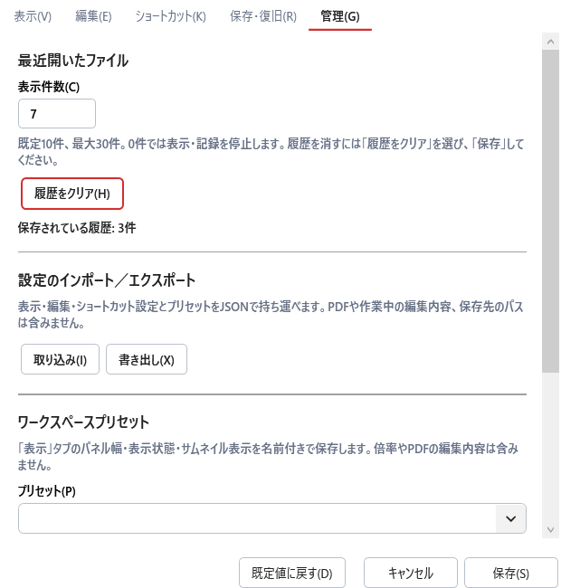

# 03-01 画面設計

## 現行画面と目標画面の区別（2026-08-30 / dev.123）

既存ワイヤーフレームと各画面の構成案はVersion 1.0の目標を含む。次の「現行実装」および設定画面の実装説明を、現在利用できる範囲として読む。

| 画面 | 現行実装と残る範囲 |
|---|---|
| メイン・OCR編集 | ページ/しおり、プレビュー、右プロパティ、状態編集を提供。補正方式・出力属性の専用UI、コメント・タグ・差分等は未実装 |
| 読み順編集 | 番号表示と読み順編集を提供。目標の階層ツリー・ルビ関連付け等がすべて揃った画面ではない |
| 検索・置換 | 検索、逐次置換、全置換を提供。目標の候補確認・条件指定の全項目は未完了 |
| 保存・検証 | 別名PDF出力と確定前検証を提供。保存方式選択、完全な入力特性警告・検証マトリクスは未完了 |
| プロジェクト作成・診断修復 | PDF/プロジェクト読込、保存、検証、バックアップ復元は利用可能。作成ウィザードと分類型の修復・救出画面は未実装 |
| 校正・確認 | 現在ページの対象一覧・状態フィルター・ページをまたぐ移動を提供。階層別進捗集計等は未実装 |
| 文書のプロパティ | 文書情報、PDFバージョン、言語、初期表示設定の編集と解析情報表示を提供 |

### 共通部品の現行デザイン

- メイン画面と文書プロパティを含む画面で共通のタブ、ドロップダウン、入力欄、ボタン、グループ枠のスタイルを使用する。タブは立体的な枠ではなく、選択項目をアクセント色の下線で示す。
- 編集可能なドロップダウンも同系統の枠・背景を使用する。状態、文字方向、校正フィルターの候補は日本語/英語の表示名を出し、言語切替時に選択値を維持する。
- ツールバーボタンは余白を抑え、パディング2 DIP、マージン1 DIPを基本とする。保存済みのサイズ設定とアイコン寸法を維持しながら主ボタンの外寸を4 DIP縮小する（最小24 DIP）。
- ステータスバーの拡大・縮小ボタンは通常時と無効時に枠を出さず、ホバー/押下時の背景とキーボードフォーカス表示を使う。
- しおり一覧のタイトル・ページ番号・編集欄は通常の文字の太さとし、行コンテナーには上下2 DIPの余白を設ける。行間隔は現状固定で、利用者が変更する設定はない。
- しおり追加と子しおり追加は、しおり形状に追加・階層を示す記号を組み合わせて区別する。100%表示は文書形状と「100」の表示を使い、ツールチップも付ける。

### アクセスキーの見直し（dev.126）

操作の意味に基づいて割り当てる。ファイルメニューはOpen=O、Save=S、Save As=A、Exit=X、設定画面はSave=S、Defaults=Dとする。追加・削除・前後移動・タブ・入力欄も英語名から選び、競合時は単語内の別の文字を使用する。意味のない連番で埋めず、関連する補助入力はTabで移動する。主要な割り当てとメニュー内の操作手順は[キーボード操作ガイド](../../../../KEYBOARD-ACCESSIBILITY.md)を参照する。Tab順序、F6領域移動、設定連動ツールチップは維持する。

### キーボード操作の追加（dev.125）

共通のアクセスキー・Tab順序・F6領域移動と、8種類の変更可能なショートカットのツールチップ表示は[キーボード操作ガイド](../../../../KEYBOARD-ACCESSIBILITY.md)に従う。入力見出しは対象の入力欄へ移動し、ボタン・チェック項目・タブは対応する操作を行う。OK・キャンセルにはアクセスキーを付けない。下部の操作ボタンへは入力欄の後にTabで移動する。文字編集には「前の文字」「次の文字」「送り幅を縮小」「送り幅を拡大」の専用ツールバー行を追加した。

## SCR-001 メイン画面

図: [ワイヤーフレーム](../../assets/svg/SCR-001_MainWindow_Wireframe.svg)

構成: メニュー、コマンドバー、ページ/ナビゲータ、中央PDFキャンバス、プロパティ、下部ツールパネル、ステータスバー。中央キャンバスはPDFレンダリング画像と編集オーバーレイを別レイヤーで合成する。

目標のステータスバーにはページ、ズーム、モード、文字方向、OCRプロバイダー、未確認数、修正数、未保存状態を表示する。現行は操作メッセージ、保存モード、倍率操作等が中心で、目標の全項目を常時表示する実装ではない。

### 文書未読込時の現行動作

dev.128の「ファイル → 最近開いたファイル」は未読込でも履歴があれば利用できる。最近の成功した読込を先頭に、PDF/プロジェクトを共通のサブメニューで表示する。ファイル名とフォルダーを表示し、長いパスは省略してツールチップで補う。履歴なし・表示0件・処理中は無効。Alt+F → R、矢印キーとEnterで操作する。

PDFが読み込まれるまでは、文書プロパティ、保存・出力、ページ/OCR/しおり操作、ページ移動・倍率等の文書依存メニューとコマンドを無効にする。ファイルを開く操作、設定、画面の表示設定、ヘルプは利用できる。PDF/プロジェクトの元PDFが読み込まれると有効になる。メニューだけでなく、対応するショートカットとダイアログ起動処理にも制限を置く。

dev.123では別文書を開く際にも保存確認を行い、読込失敗時には元の文書と編集を保持する。dev.129ではページ追加・削除・並べ替え・90度回転もUndo/Redo対象とし、操作前のOCR履歴、しおり、選択状態を保持する。その他の残件は[実装状況](../../../../IMPLEMENTATION_STATUS.md)を参照する。

### 表示倍率の現行動作

ステータスバーのスライダー、隣の倍率ドロップダウン、上部ツールバーの拡大・縮小・100%・フィット操作を同じ現在倍率へ同期する。ドロップダウンでの選択や直接入力の確定・取消後も同期を維持する。

| スライダー位置 | 倍率 |
|---|---|
| 左端～中央 | 25%～100%を線形に対応 |
| 中央 | 100%。縦の目安線を表示 |
| 中央～右端 | 100%～400%を線形に対応 |

軸はつまみの左右で色を変えず、単色の中立グレーとする。軸クリックはその位置へ移動する。左右でスケールは異なるが、矢印キーは1パーセントポイント、PageUp/PageDownは10パーセントポイントずつ倍率を変更する。

## SCR-002 OCR編集

図: [モックアップ](../../assets/svg/SCR-002_OcrEdit_Mockup.svg)

右プロパティは以下を含む。

- 文字列: 原文、編集後
- 配置: X/Y/幅/高さ、始点・終点
- 変形: 補正方式、横/縦倍率、文字間隔
- 回転: 角度、中心、0度復帰、周辺へ整列
- 組版: 横書き/縦書き、進行方向、段落
- 属性: 検索、コピー、読み上げ、出力
- レビュー: 状態、コメント、タグ

## SCR-003 読み順編集

中央に番号付き領域、左または右に階層ツリーを表示する。自動推定、番号再計算、グループ化、読み上げ対象外、ルビ関連付けを提供する。

## SCR-004 検索・置換

検索条件、対象範囲、候補一覧、画像抜粋、文脈、置換操作、進捗を表示する。全置換と逐次確認を同一画面で切り替える。

## SCR-005 保存・検証

更新方式、フォント戦略、保存先、署名/PDF特性の警告を表示する。処理中は生成・構造検査・描画・文字検査の進捗を示し、完了後に正常/警告/エラー別のレポートを表示する。

## SCR-006 プロジェクト作成

元PDF参照/内包、OCR結果取り込み、OCR実行、プロジェクト保存先を段階的に選ぶ。外部送信を伴うOCRは別ステップで確認する。

## SCR-007 プロジェクト診断・修復

図: [ワイヤーフレーム](../../assets/svg/SCR-003_ProjectDiagnostics_Wireframe.svg)

ZIP、manifest、ページJSON、元PDF参照、履歴、キャッシュを検査し、自動修復可能/確認必要/復旧候補/修復困難に分類する。

## SCR-008 設定

一般、表示、OCR、編集、保存、プロジェクト、ショートカット、プライバシー、ログ、プラグイン、詳細に分ける。Portable/AppDataモードは現在値と保存先を明示する。

dev.127では「表示」「編集」「ショートカット」「保存・復旧」「管理」の5タブを提供する。表示ではUI言語、ツールバー・パネル・サムネイル、OCRオーバーレイ、文字セル、文字幅調整ハンドル、領域サイズ変更ハンドルを設定できる。編集ではUndo履歴数と画像支援文字幅推定、ショートカットでは主要操作のキー割当、保存・復旧では自動保存間隔とバックアップ世代数を設定できる。管理では設定のJSON移出入と、固定パネル配置の名前付きプリセットを操作する。従来の保存先タブは管理内の折りたたみ項目へ移動し、動作モードと設定ファイルの場所を読み取り専用で表示する。OCR、プロジェクト修復、プライバシー、ログ、プラグイン、詳細の専用カテゴリは未実装である。

新しい部品も共通スタイル・意味に基づくアクセスキー・Tab順序に従う。インポート、配置適用、登録・更新・削除は下書きに対する操作で、「保存」でのみ本画面と保存ファイルに反映する。「キャンセル」は下書きを破棄する。[対象範囲・確認・形式制限・操作手順](../../../../SETTINGS-WORKSPACES.md)を参照。

dev.128では管理タブ先頭に最近開いたファイルの表示件数（既定10件、0～30件）、履歴クリア、保持件数／クリア予約の説明を追加。0件は表示・記録停止であり履歴削除とは別。クリアは確認を経て設定の「保存」で確定し、キャンセル・設定保存失敗時は実行しない。Count=C、History=HのアクセスキーとTab順序、共通入力・ボタンスタイルを使用し、管理タブは縦スクロール、下部の保存・キャンセルは固定する。詳細は[履歴操作ガイド](../../../../RECENT-FILES.md)を参照。

旧dev.127の[設定画面記録](../../assets/png/SCR-008_SettingsManagement-dev127-ja.png)は履歴として保持する。旧SVGはPDF作業画面の模式図であり、ファイルメニューの展開内容や管理タブを描いていないため、今回の変更は上記の実装画像と画面仕様で補う。設計PDFは従来のスナップショットのままである。

## SCR-009 校正・確認（現行実装）

図: [校正・確認モードの模式図](../../assets/svg/SCR-009_ReviewMode_Wireframe.svg)

上部ツールバーで「校正・確認」を選ぶと、右プロパティ上部に次を表示する。

- 「未確認・要再確認」（既定）、「未確認」、「要再確認」、「すべてのステータス」のフィルター。
- 現在ページの対象件数と、読み順番号・文字列を表示する対象一覧。削除済み領域は含めない。
- 「前の対象」「次の対象」「確認済みにして次へ」。確認済みにする操作は単一領域の選択時に利用できる。
- 該当なしの案内、および検索中の進捗と「検索を中止」。

対象一覧の選択と前後移動では、対象が見えるようプレビューをスクロールする。現在ページに対象がなくても別ページへ検索でき、文書端で循環しない。文字修正で一覧から外れても、選択中の編集欄は維持する。フィルターとモードはプロジェクトに保存しない。

通常の配置・文字幅・領域構造操作は無効にし、文字・単語の読み・確認状態を編集する。OCR品質分析のキーワード幅補正も実行不可とする。文字挿入/削除による通常の配置再計算は行うため、完全な配置ロックではない。全置換後は「要再確認」とする。操作と例外の詳細は[UX・操作フロー](../02_UIUX/02-01_UXAndWorkflows.md)を参照する。

## SCR-010 文書のプロパティ（現行実装）

図: [文書プロパティの模式図](../../assets/svg/SCR-010_DocumentProperties_Wireframe.svg)

文書読込後に開く所有者付きダイアログで、最大化・最小化・サイズ変更を行わない。概要、セキュリティ、フォント、カスタム、詳細設定のタブを共通の下線型デザインで表示する。ドロップダウンはメイン画面と共通のスタイルを使用する。

- 概要: タイトル、作者名、主題、キーワード、作成アプリケーション、PDF変換ソフトを編集する。作成日・更新日、ファイル情報、解析情報は読み取り専用。
- 詳細設定: 元PDFバージョンの確認、出力バージョン（自動/1.4/1.5/1.6/1.7/2.0）、初期ページレイアウト、綴じ方向、表紙単独表示、文書言語を設定する。元PDFより低い版は選択できない。
- 文書言語: 読み上げオプションの候補選択とBCP 47形式の直接入力に対応する。音声選択や翻訳の機能ではない。
- 適用した編集値はプロジェクトの保存対象となり、PDFへの反映はPDF出力時に行う。元PDFをその場で上書きしない。

空欄指定とPDFへの反映先等は[PDF編集仕様](../06_PDF/06-01_PdfEditing.md)を参照する。

## モックレビューで確定する項目

- 色、テーマ、アイコン、余白、最小画面サイズ
- ダブルクリックやホイール修飾操作
- パネルの既定配置と最小幅
- Acrobat準拠ショートカットの正確な対応表
