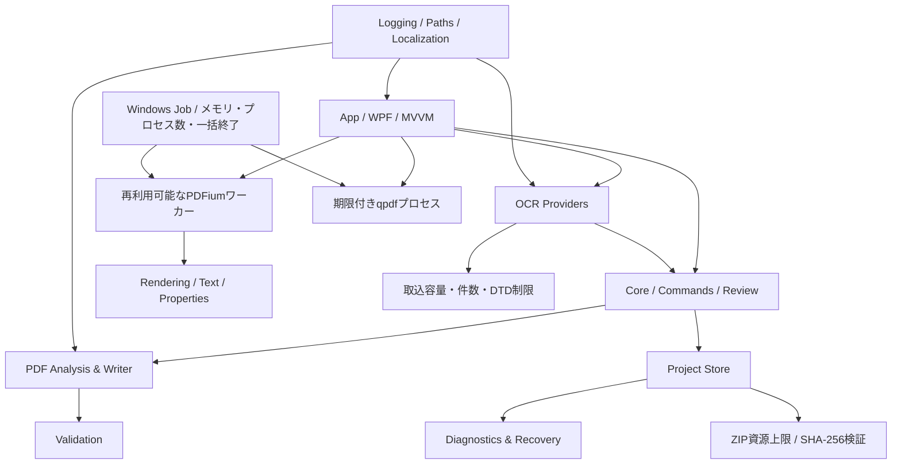

# 04-01 アーキテクチャ

## 1. 論理構成



上図のワーカーとqpdfは画面プロセス外で動作し、dev.131ではWindowsジョブによる資源・終了制約を受ける。ジョブは同一利用者トークンのままであり、AppContainer、権限縮小、独立サービスを示すものではない。

## 2. 推奨ソリューション

以下はVersion 1.0の目標境界である。現行ソリューションの物理構成は`PdfCorrectorium.App`、`Core`、`ProjectFormat`、`Infrastructure`および`ContractTests`であり、Rendering/Pdf/Ocr/Validation/Plugin.Abstractionsは独立プロジェクト化されていない。PDFium・qpdf・OCR取込・出力検証の実装は現在Appプロジェクト内のServiceへ集中している。

```text
PdfCorrectorium.App             WPF、View、ViewModel、ドッキング
PdfCorrectorium.Core            文書モデル、コマンド、Undo、レビュー
PdfCorrectorium.Rendering       PDF描画、座標変換、サムネイル
PdfCorrectorium.Pdf             解析、コンテンツストリーム、Catalog、保存
PdfCorrectorium.Ocr             共通OCRモデルとプロバイダー
PdfCorrectorium.ProjectFormat   .pdfocrproj、移行、復旧
PdfCorrectorium.Validation      保存後検証、レポート
PdfCorrectorium.Infrastructure  ログ、設定、パス、ローカライズ
PdfCorrectorium.Plugin.Abstractions 将来の拡張契約
PdfCorrectorium.Tests.*         単体、統合、ゴールデン、UI
```

## 3. 境界

- UIはPDFライブラリやベンダーOCR JSONを直接参照しない。
- CoreはWPF型に依存せず、座標と色は独自の値型を使う。
- ネイティブ依存はRendering/Pdf/Ocr実装へ閉じ込める。
- プロジェクト保存は論理モデルのスナップショットと操作ログを扱い、ViewModelを保存しない。

## 4. 主要インターフェース

```csharp
public interface IPdfRenderer { }
public interface IPdfAnalyzer { }
public interface IPdfWriter { }
public interface IOcrProvider { }
public interface IProjectStore { }
public interface IOutputValidator { }
public interface IApplicationDataPathProvider { }
public interface IClock { }
```

正確なメソッド契約は詳細設計で定める。すべての長時間処理は`CancellationToken`と進捗通知を持つ。

上記インターフェース群は設計目標であり、現行ソースには同名の共通契約は存在しない。独立プロジェクト化または本設計の改訂をVersion 1.0安定化前に判断する。

## 5. 編集方式

Commandパターンで編集を適用し、OCR編集レイヤーへ記録する。文字列と幾何の原値を保持し、画面プレビューは編集モデルから生成する。PDFは保存時のみ生成する。

現行dev.132のViewModelは、OCR領域差分とページ構成スナップショットを1本の時系列履歴へ格納する。ページ構成スナップショットはプロジェクトモデル、作業PDF参照、NDLOCR情報、ページ別OCR表示キャッシュ・寸法、サムネイル、しおりを含むプロジェクト状態、表示ページ・複数ページ選択・OCR選択を保持する。OCR表示モデルの参照を復元点で維持することで、ページ操作をUndoした後も、それ以前のOCR差分が同じ領域へ適用される。復元先PDFは状態切替前に描画検証し、失敗時は履歴スタックを移動しない。作業PDFはロック付きセッションで所有し、現在状態または到達可能なUndo/Redo履歴から外れた時点で回収する。

## 6. 座標変換

画像ピクセル、PDFユーザー空間、ページ回転、CropBox、画面ズーム、領域ローカル座標を明確に分ける。変換は一箇所へ集約し、丸めは表示時のみ行う。

変換順序は、文字配置 → 文字間隔/伸縮 → ローカル整列 → 回転 → ページ座標配置とする。

## 7. 依存ライブラリ方針

PDFium系、PdfPig、qpdf、PDFsharp等は候補であり、採用は固定バージョンの機能・ライセンス・ARM64・配布物監査後にADRで確定する。MuPDF/iText/Ghostscript等のコピーレフトまたは商用条件はApache-2.0配布方針との適合を個別判断する。

## 8. 障害分離

外部OCRやqpdf等のプロセスは標準出力/エラー、終了コード、タイムアウト、キャンセルを管理する。dev.131では全qpdf経路を共通ランナーへ移し、5分の期限、出力量上限、キャンセル時のプロセスツリー終了を適用する。PDF出力ワーカーは30分を上限とし、Windowsジョブで子qpdfを含めて収容する。

PDFiumによるプレビュー、文字境界抽出、文書プロパティ読込は、画面プロセスとは別の長寿命ワーカーへ直列要求する。画像は上限付き一時PNG、構造化結果は上限付きJSONで受け渡し、出力先を専用一時ルート内へ限定する。通信行や結果の異常、ネイティブクラッシュ、応答断、期限超過、キャンセル時はワーカーを終了し、次回要求時に再生成する。PDFium 154.0.8035とqpdf 12.4.1の取得元・ハッシュはリポジトリ直下の依存ロックで固定する。
