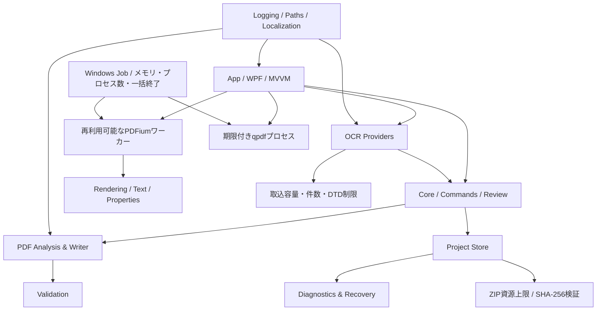

# 04-01 アーキテクチャ

## dev.158の隔離出力境界

- 親プロセスは、現在のプロジェクトをそのまま非埋込保存しない。実際に出力へ使う準備済みPDFから、処理専用の相対参照、ファイルサイズ、SHA-256を生成した一時プロジェクトを作る。これにより、ポータブルプロジェクトの`relativePath=null`を通常モードへ誤変換せず、大容量PDFも二重に格納しない。
- 子プロセスは一時プロジェクトの通常の形式検証に加え、コマンドラインで明示された元PDFと記録済み指紋を照合する。論理ページ操作を実体化した一時PDFも、その実体を基準に再指紋化する。
- 状態ファイルの書込みはワーカー単位の直列化器を通し、毎回一意な一時ファイルを閉じてから原子的に置換する。進捗通知の完了を待ってから完了／失敗状態を書くため、古い進捗が終端状態を上書きしない。
- 保存先の確定は同一フォルダーの一時ファイルと処理固有バックアップを使って原子的に置換する。確定済み保存先を正本とし、その後のキャッシュ削除失敗は成功を取り消さない。

## dev.161の墨消し画像・OCR保持境界

- `PdfExportService`は墨消し対象ページの通常画像最適化を省き、編集済み表示内容から直接300 DPI・JPEG品質99の置換画像を作る。上限は長辺14,000画素・約96メガピクセルとし、画質改善が無制限なネイティブメモリ消費へつながらないようにする。
- 画像化前に、`Tr=3`または塗り透明度0のテキストオブジェクトのうち、1ポイントの安全余白を加えた全墨消し範囲と交差しないものだけを保持対象へ分離する。可視オブジェクト、交差する文字行、全注釈は従来どおり除去する。
- 出力検証はページ全体の文字数ではなく、PDFiumが返す各文字境界と墨消し範囲の交差を共通規則で判定する。範囲外OCRの有効性と範囲内情報除去を両立し、将来の保持対象拡張もこの境界へ集約する。

## dev.157のポインター入力と採色境界

- スポイト待機はViewの一時状態とし、ViewModelやプロジェクトへ独立フラグを保存しない。採色は現在の`BitmapSource`とページ表示矩形の座標変換だけで行い、OCR・墨消し・選択オーバーレイを描画し直した画像からは取得しない。
- 取得した`#RRGGBB`だけを既存の色変更操作へ渡す。選択中ならUndo可能な範囲色変更、未選択なら次回作成色となるため、採色専用の永続モデルや一時画像を追加しない。
- Deleteのルーティングは編集モード、選択墨消し、コマンド可否、フォーカス先を1か所で判定し、`TextBoxBase`・`PasswordBox`内では既定の文字削除を維持する。
- 通常ホイールは未選択時だけScrollViewerへ明示的に渡し、OSの行数またはページ単位設定を表示量へ変換して上下限で丸める。Ctrl＋ホイールの倍率変更とは先に分岐し、モード別実装を増やさない。

## dev.156の墨消し後編集と表示境界

- `PdfRedaction.ColorHex`はプロジェクトへ保存する出力色、`RedactionOverlayViewModel.ColorHex`は現在画面へ通知する射影とする。選択範囲の色変更は固定IDで永続モデルと射影を同時に更新し、注釈スナップショット履歴へ1回だけ記録する。
- 範囲選択はページ上のクリックと一覧選択を同じ`SelectedRedaction`へ集約する。個別削除もこの固定IDを用い、表示だけを消してプロジェクトに残す状態を作らない。削除・色変更のUndo/Redoは既存のプロジェクト注釈履歴を再利用する。
- 半透明／不透明は`RedactionPreviewOpacity`から導く一時的UI状態であり、`PdfRedaction`や保存形式へ追加しない。安全なPDF出力は従来どおりRGB色の不透明塗りで、編集表示の選択に依存しない。
- 移動用Thumbは入力だけを担当する透明なテンプレートとし、表示色・枠線は専用Borderへ分離する。これによりWPF既定テーマの背景色が墨消し面を覆う依存を排除する。

## dev.155の見開き遷移境界

- ページ切り替え方式の見開きナビゲーションは、選択ページを先に変更せず、移動先の編集ページを対話用PDFワーカー、相方ページを背景用PDFワーカーで準備する。
- 文書・現在ページ・表示設定が準備開始時と一致する場合だけ、選択ページ、編集用画像、相方画像を同一Dispatcherターンで反映する。準備中も現在の完全な見開きを維持し、単一ページの中間状態を描画しない。
- 新しい移動、文書終了、単一／見開き、切り替え／連続、表紙、綴じ方向の変更は専用CancellationTokenSourceで古い準備を中止する。完了・取消の両経路でトークンを解放し、結果やバックグラウンド処理を蓄積しない。

## dev.154の墨消し範囲変形境界

- `RedactionOverlayViewModel`は現在ページの表示座標と選択状態だけを通知する軽量な画面モデルとする。ドラッグごとに永続プロジェクトを複製せず、画面部品へ位置・寸法変更を通知する。
- WPF層はMoveおよびN/NE/E/SE/S/SW/W/NWの操作方向からページ内の候補矩形を計算する。ViewModelは候補をページ境界と最小寸法へ正規化し、表示側の防御だけへ依存しない。
- ドラッグ完了時だけ、表示座標をPDFポイントへ変換して固定IDの`PdfRedaction`を置換する。開始前後のプロジェクト注釈スナップショットを1組だけUndo履歴へ積み、連続Pointerイベントによる履歴・割当増加を避ける。
- キャンセル時は永続モデルから画面モデルを再生成する。OCR編集へ戻ると墨消しレイヤーのヒットテストを止め、OCR選択経路との入力競合を構造的に防ぐ。

## dev.153の排他的な編集モード境界

- `EditorInteractionMode`をOCR編集、読み順編集、校正・確認、墨消しの型付き状態としてViewModelに集約する。ツールバー、モード一覧、右ペイン、ポインター処理、コマンド可否が個別の真偽値を持たず、この1値から派生する。
- 墨消しモードでは`CanEditGeometry`と`CanAddOcrRegion`を偽にし、OCR変更コマンドを入口で拒否する。ビューのドラッグ処理も同じモード値で墨消し矩形へ分岐するため、表示と実処理のモード不一致を作らない。
- OCR文字・領域の事前選択はモード切替時に保持するが、墨消し中のクリックはOCR配置変更へ渡さない。墨消し追加後もモードを維持し、Escまたは明示操作でOCR編集へ戻す。
- 編集モードは作業方法を示す一時的UI状態であり、PDF内容・プロジェクトデータ形式・Undo履歴を変更しない。墨消し範囲自体だけを既存のプロジェクト注釈履歴へ保存する。

## dev.152の墨消し境界

- Coreの`PdfRedaction`は固定ページID、PDFポイント矩形、色と任意のOCR由来参照だけを保持する。WPFプレビュー座標、墨消し後画像、一時PDFは永続モデルへ入れない。
- ViewModelは選択文字／OCR領域／任意矩形をPDF座標へ変換し、コメント・内部リンクと同じプロジェクト注釈Undo/Redoへ積む。表示倍率や現在のプレビュー画像を正本にしない。
- `PdfExportService`は墨消し対象ページをレンダリングし、塗りつぶし後に元の可視オブジェクトと注釈を削除して画像1枚へ置換する。dev.161では文字境界を使って範囲外の不可視OCR文字を保持し、部分交差するテキストオブジェクトは範囲外の連続断片だけを再構成する。qpdfによる未参照オブジェクト整理とPDFiumによる範囲内抽出文字不在・再描画検証を通過した成果物だけを保存先へ確定する。
- 対象ページ単位の画像化は、PDF描画命令の種類ごとに安全な部分除去を証明する複雑さを避ける保守的な境界である。代償として注釈、構造タグ、ベクター品質を失い、範囲と接する文字行は行全体を除去する。この制約をUIと文書へ明示する。

## dev.151の対話処理と先読み処理の分離

- PDFiumは引き続き画面プロセス外で動かす。現在ページ、文字境界、文書情報など利用者が明示した処理は対話用ワーカーへ送り、サムネイル、隣接ページ、連続表示、検索・品質分析の走査は先読み用ワーカーへ送る。
- 各ワーカー内のPDFium要求は直列化し、プロセス間では独立させる。先読みのキャンセルや再起動が対話処理の通信境界へ影響せず、長い先読みキューがページ移動を待たせない構造とする。
- アプリ終了時は両ワーカーをWindowsジョブごと終了し、専用一時出力を回収する。UIスレッドはワーカー応答を同期的に待たず、診断経路も非同期で待機する。

## dev.148の直交するページ配置とスクロール方式

- アプリ設定をページ配置（単一／見開き）とフロー（切り替え／連続）の2軸に分離する。形式15までの連続ページ値は形式16で単一ページ＋連続スクロールへ移行する。
- `ContinuousPagePanel`は単一ページ行と見開き行を同じ仮想配置で扱い、実ページの矩形だけを描画する。欠けた側は綴じ位置を保つ幅だけ計算し、画面部品やページ画像を生成しない。
- 見開き行は`FacingPageLayoutCalculator`を再利用し、ページ切り替え表示と連続表示の左右規則を一致させる。画面部品と画像は現在ページおよび表示周辺の最大12ページに限定する。

## dev.147の見開き配置計算

- `FacingPageLayoutCalculator`を、現在ページ、総ページ数、表紙単独表示、綴じ方向から左右ページ番号を返す副作用のない規則として分離する。画面の左右配置と相手ページの遅延描画は同じ結果を使用し、条件分岐の重複による食い違いを避ける。
- 表紙単独表示時は1ページ目だけを綴じ方向に応じた外側へ置く。それ以外は2ページ単位で組を求め、左綴じは若いページを左、右綴じは若いページを右へ配置する。文書末尾に相手がない場合は欠けた側を空白とする。
- 設定変更では現在のPDF、OCRモデル、Undo履歴を変更しない。進行中の相手ページ描画を中止し、新しい組の相手が存在する場合だけ隔離PDFiumワーカーへ再描画を要求する。設定形式は15、プロジェクト形式は1.4のままとする。

## dev.146の連続ページ仮想配置

- `ContinuousPagePanel`は全論理ページの番号、基準寸法、縦位置だけを保持して文書全体のスクロール範囲を提供する。ページごとのWPF画面部品や画像を全件生成しない。
- 現在ページの既存編集面に加え、表示範囲と前後1画面に入るページだけを画面部品として生成する。補助画像はLRU順の最大12件とし、範囲外の画面部品は取り外す。
- スクロール通知は90ミリ秒へ集約し、古い描画をキャンセルする。描画は既存の隔離PDFiumワーカーを使い、UIスレッド上でPDFを処理しない。
- ページをクリックしたときは保留入力を確定し、既存編集面を対象ページ位置へ差し替える。ページ画像の複製やプロジェクトデータの変更は行わず、現在のスクロール位置と倍率を維持する。

## dev.143の論理ページ境界と保存境界

- ページ削除・並べ替え・回転は`ProjectPageReference`列への変更としてCoreモデルに保持し、元PDFを不変とする。プレビュー時は論理ページを元PDFページへ写像し、回転後の画像とOCR座標を表示する。
- PDF全体の実体化は外部ページ挿入、画像最適化解析、最終出力の境界へ集約する。削除・並べ替え・回転のUndo/Redoはプロジェクトモデルだけを復元し、作業PDFやサムネイルを複製しない。
- 形式1.4は`project.json`を唯一のJSON正本とし、ページ別JSON、元PDF参照JSON、サムネイルの重複保存を廃止する。内包PDFは既に圧縮済みであるためZIPの無圧縮エントリとする。
- QDF文字送り補正はマーク索引を一度のストリーム走査で作り、必要な周辺だけを解析し、置換箇所以外を順次コピーする。PDF容量に比例する大きな管理メモリを要求しない。

- `InputPdfInspectionService`はPDFiumで得る文書プロパティと、上限付きの先頭／末尾構造スキャンを組み合わせ、安定したコードを持つ注意事項へ変換する。結果はUI上の助言であり、PDFの完全な構文解析・署名検証・安全性判定とは区別する。
- コメント、タグ、内部リンクはCoreのプロジェクト集約に保存し、WPFの状態を直接シリアライズしない。ページとOCR領域の不変IDを参照して、ページ並べ替え後も移動先を追跡する。
- PDF出力時は既存のqpdfオブジェクト編集経路でLink注釈とGoTo移動先を追加する。元PDFの既存注釈配列は保持し、解決不能な本アプリ管理リンクは出力しない。
- 形式1.3のリンク型プロジェクトは、プロジェクト位置を基準とする正規化済み相対パスで通常の元PDFを直接参照する。絶対パスは保存せず、ルート付き・ドライブ指定・空要素・`.`を拒否する。埋め込みPDFからの変換とページ編集済み作業PDFだけを、内容ハッシュ名で隣接`.assets`へ永続化する。

## 1. 論理構成



上図のワーカーとqpdfは画面プロセス外で動作し、dev.131ではWindowsジョブによる資源・終了制約を受ける。ジョブは同一利用者トークンのままであり、AppContainer、権限縮小、独立サービスを示すものではない。

## 2. 推奨ソリューション

以下はVersion 1.0の目標境界である。現行ソリューションの物理構成は`PdfCorrectorium.App`、`Core`、`ProjectFormat`、`Infrastructure`および`ContractTests`であり、Rendering/Pdf/Ocr/Validation/Plugin.Abstractionsは独立プロジェクト化されていない。PDFium・qpdf・OCR取込・出力検証の実装は現在Appプロジェクト内のServiceへ集中している。

```text
PdfCorrectorium.App             WPF、View、ViewModel、ドッキング
PdfCorrectorium.Core            文書モデル、コマンド、Undo、レビュー
PdfCorrectorium.Rendering       PDF描画、座標変換、サムネイル
PdfCorrectorium.Pdf             解析、コンテンツストリーム、Catalog、保存
PdfCorrectorium.Ocr             共通OCRモデルとプロバイダー
PdfCorrectorium.ProjectFormat   .pdfocrproj、移行、復旧
PdfCorrectorium.Validation      保存後検証、レポート
PdfCorrectorium.Infrastructure  ログ、設定、パス、ローカライズ
PdfCorrectorium.Plugin.Abstractions 将来の拡張契約
PdfCorrectorium.Tests.*         単体、統合、ゴールデン、UI
```

## 3. 境界

- UIはPDFライブラリやベンダーOCR JSONを直接参照しない。
- CoreはWPF型に依存せず、座標と色は独自の値型を使う。
- ネイティブ依存はRendering/Pdf/Ocr実装へ閉じ込める。
- プロジェクト保存は論理モデルのスナップショットと操作ログを扱い、ViewModelを保存しない。

## 4. 主要インターフェース

```csharp
public interface IPdfRenderer { }
public interface IPdfAnalyzer { }
public interface IPdfWriter { }
public interface IOcrProvider { }
public interface IProjectStore { }
public interface IOutputValidator { }
public interface IApplicationDataPathProvider { }
public interface IClock { }
```

正確なメソッド契約は詳細設計で定める。すべての長時間処理は`CancellationToken`と進捗通知を持つ。

上記インターフェース群は設計目標であり、現行ソースには同名の共通契約は存在しない。独立プロジェクト化または本設計の改訂をVersion 1.0安定化前に判断する。

## 5. 編集方式

Commandパターンで編集を適用し、OCR編集レイヤーへ記録する。文字列と幾何の原値を保持し、画面プレビューは編集モデルから生成する。PDFは保存時のみ生成する。

現行dev.143のViewModelは、OCR領域差分とページ構成スナップショットを1本の時系列履歴へ格納する。ページ構成スナップショットは論理ページ列を含むプロジェクトモデル、元PDF参照、NDLOCR情報、ページ別OCR表示キャッシュ・寸法、しおり、表示ページ・複数ページ選択・OCR選択を保持する。再生成可能なサムネイルと、削除・並べ替え・回転用のPDF複製は含めない。固定ページIDとOCR表示モデルの参照を復元点で維持することで、ページ操作をUndoした後も、それ以前のOCR差分が同じ領域へ適用される。

外部ページ挿入だけは複数PDFを単一の新しい物理元PDFへ統合するため、ロック付き`PageWorkingFileStore`を使用する。挿入履歴の枝破棄、履歴上限、文書切替、終了で到達不能になったPDFを直ちに回収する。通常モードでその一時PDFを永続化する場合だけ内容ハッシュ名の`.assets`へ移す。論理編集だけなら安定した元PDFを直接参照し続ける。

## 6. 座標変換

画像ピクセル、PDFユーザー空間、ページ回転、CropBox、画面ズーム、領域ローカル座標を明確に分ける。変換は一箇所へ集約し、丸めは表示時のみ行う。

変換順序は、文字配置 → 文字間隔/伸縮 → ローカル整列 → 回転 → ページ座標配置とする。

## 7. 依存ライブラリ方針

PDFium系、PdfPig、qpdf、PDFsharp等は候補であり、採用は固定バージョンの機能・ライセンス・ARM64・配布物監査後にADRで確定する。MuPDF/iText/Ghostscript等のコピーレフトまたは商用条件はApache-2.0配布方針との適合を個別判断する。

## 8. 障害分離

外部OCRやqpdf等のプロセスは標準出力/エラー、終了コード、タイムアウト、キャンセルを管理する。dev.131では全qpdf経路を共通ランナーへ移し、5分の期限、出力量上限、キャンセル時のプロセスツリー終了を適用する。PDF出力ワーカーは30分を上限とし、Windowsジョブで子qpdfを含めて収容する。

PDFiumによるプレビュー、文字境界抽出、文書プロパティ読込は、画面プロセスとは別の長寿命ワーカーへ直列要求する。画像は上限付き一時PNG、構造化結果は上限付きJSONで受け渡し、出力先を専用一時ルート内へ限定する。通信行や結果の異常、ネイティブクラッシュ、応答断、期限超過、キャンセル時はワーカーを終了し、次回要求時に再生成する。PDFium 154.0.8035とqpdf 12.4.1の取得元・ハッシュはリポジトリ直下の依存ロックで固定する。
