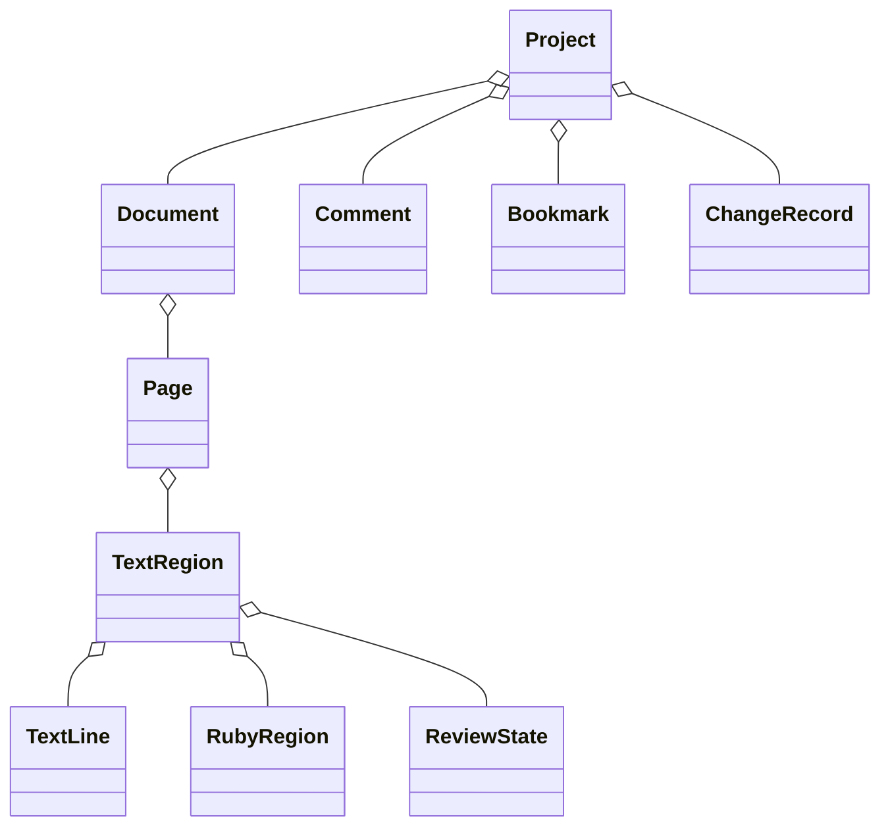

# 05-01 データモデル

## 1. 集約

## 2. 主要エンティティ

### Document

文書ID、元PDF参照、ページ、ViewerSettings、OCRプロバイダー履歴、フォント方針、検証履歴を持つ。

### Page

ページID、PDFページ索引、MediaBox/CropBox、ページ回転、領域、読み順グラフ、状態集計を持つ。

### TextRegion / TextLine

- `OriginalText` / `EditedText`
- `OriginalGeometry` / `EditedGeometry`
- `WritingMode`: horizontal / vertical
- `FlowDirection`: ltr / rtl / ttb / btt
- `RotationDegrees`、`RotationCenter`
- ローカル矩形とページ上の四隅
- `HorizontalScale`、`VerticalScale`、`CharacterSpacing`
- `CharacterAdvances`: Unicode文字要素ごとの送り幅。横書きはローカルX方向、縦書きはローカルY方向の実長を保持する。
- `FitMode`: stretch / spacing / distribute / mixed / auto / positionOnly
- 段落、親領域、OCR由来、信頼度、言語
- 検索/コピー/読み上げ/PDF出力フラグ

### RubyRegion

表示文字列、読み文字列、本文領域ID、読み上げ・検索・コピー・出力属性を持つ。本文との関連がなければ読み上げ対象外を既定とする。

### ReviewState

`unreviewed`、`verified`、`modified`、`needsReview`、`excluded`、`deferred`。表示名はローカライズし、保存値は固定コードとする。

### ReadOrder

単純な番号だけでなくグループと子順序を表せる有向非循環構造を基本とする。循環は検証エラー。

### Comment / Bookmark

対象種別・ID、本文、状態、重要度、タグ、作成・更新時刻を持つ。個人名は将来の共同編集に備え任意フィールドとする。

### ChangeRecord

操作ID、相関ID、時刻、対象、変更種別、変更前後の要約を保持する。Undo用コマンドと監査履歴は別データ。

## 3. 幾何モデル

水平AABBだけでなく、回転済み四辺形を保持する。回転中心と変換行列は倍精度で管理し、NaN/Infinity/ゼロ面積/ページ外を検証する。

## 4. 不変条件

- IDはプロジェクト内で一意。
- 元値は取り込み後に上書きしない。
- 編集値が未設定なら元値を有効値とする。
- 読み順は循環しない。
- 出力対象文字列はUnicodeへ変換可能。
- 幾何値は有限で、面積が正。
- `CharacterAdvances`はすべて正の有限値で、要素数は有効文字列のUnicode文字要素数と一致する。文字幅情報がない旧データは行長を均等分割して補完する。
- 分割・結合は出自IDを残す。

## 5. 変更状態

編集操作に応じて`modified`へ移る。一括処理、段落再構成、読み順自動再計算など間接影響は`needsReview`にする。利用者は手動変更できるが、変更履歴へ残す。

## 6. シリアライズ

- JSONの列挙値は英語固定コード。
- 時刻はISO 8601 UTC、表示時にローカル化。
- 座標単位と座標原点をファイルに明記。
- 未知フィールドを破棄しない読み書きを検討する。
- スキーマバージョンごとの移行テストを持つ。
