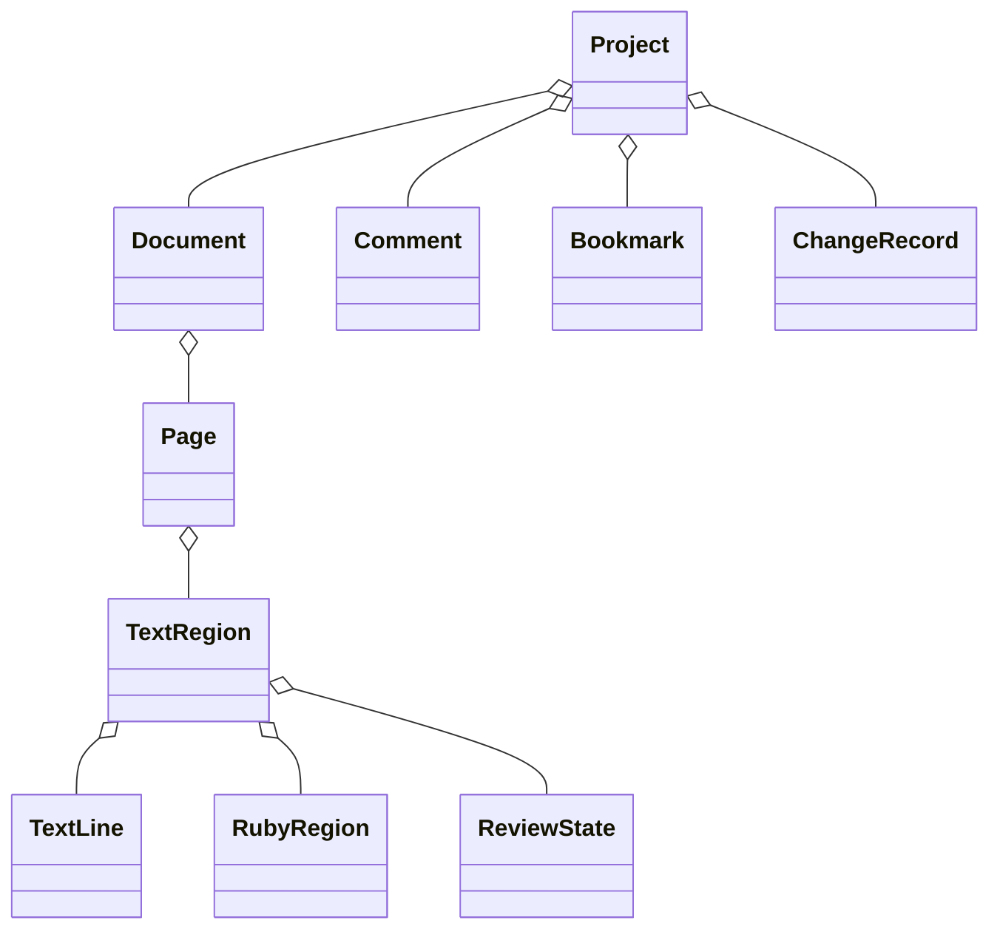

# 05-01 データモデル

## 現行実装上の制約（2026-08-30 / dev.123）

以下にはVersion 1.0の目標モデルを含む。領域レビュー状態は実装済みだが、階層別状態集計、コメント・タグ・監査履歴・ルビ関連付けUI等は未実装である。校正のモードと対象フィルターは一時的なUI状態であり、領域のレビュー状態とは別に扱い、プロジェクトには保存しない。

dev.123では`HasEditedText`で意図的な空文字を区別する。`HasEditedText=true`なら空文字も有効値で、旧形式の非空`EditedText`も読み込む。旧形式の空`EditedText`は従来どおり未編集として扱う。保存時は既存モデルを基に編集項目のみ更新し、親領域ID・補正方式・出力属性・方向属性を保持する。

## 1. 集約

## 2. 主要エンティティ

### Document

文書ID、元PDF参照、ページ、ViewerSettings、OCRプロバイダー履歴、フォント方針、検証履歴を持つ。

### Page

ページID、PDFページ索引、MediaBox/CropBox、ページ回転、領域、読み順グラフ、状態集計を持つ。

### TextRegion / TextLine

- `OriginalText` / `EditedText`
- `OriginalGeometry` / `EditedGeometry`
- `WritingMode`: horizontal / vertical
- `FlowDirection`: ltr / rtl / ttb / btt
- `RotationDegrees`、`RotationCenter`
- ローカル矩形とページ上の四隅
- `HorizontalScale`、`VerticalScale`、`CharacterSpacing`
- `CharacterAdvances`: Unicode文字要素ごとの送り幅。横書きはローカルX方向、縦書きはローカルY方向の実長を保持する。
- `FitMode`: stretch / spacing / distribute / mixed / auto / positionOnly
- 段落、親領域、OCR由来、信頼度、言語
- 検索/コピー/読み上げ/PDF出力フラグ

### RubyRegion

表示文字列、読み文字列、本文領域ID、読み上げ・検索・コピー・出力属性を持つ。本文との関連がなければ読み上げ対象外を既定とする。

### ReviewState

`unreviewed`、`verified`、`modified`、`needsReview`、`excluded`、`deferred`。表示名はローカライズし、保存値は固定コードとする。

### ReadOrder

単純な番号だけでなくグループと子順序を表せる有向非循環構造を基本とする。循環は検証エラー。

### Comment / Bookmark

対象種別・ID、本文、状態、重要度、タグ、作成・更新時刻を持つ。個人名は将来の共同編集に備え任意フィールドとする。

### ChangeRecord

操作ID、相関ID、時刻、対象、変更種別、変更前後の要約を保持する。Undo用コマンドと監査履歴は別データ。

現行dev.132のUndo用ページ構成履歴は保存プロジェクト形式の`ChangeRecord`ではなく、実行中だけ保持する前後スナップショットである。追加・削除・並べ替え・90度回転ごとに作業PDF、`PdfCorrectoriumProject`、ページ別OCR表示キャッシュ、選択状態を対で保持し、OCR領域差分と同じ履歴順序へ積む。作業PDFは現在状態または到達可能なUndo/Redoスナップショットから参照される間だけ保持し、枝の破棄、履歴上限による削除、文書切替、終了時に回収する。プロジェクト保存後やアプリ再起動後にUndo履歴そのものを復元する機能、監査履歴として永続化する機能とは区別する。

## 3. 幾何モデル

水平AABBだけでなく、回転済み四辺形を保持する。回転中心と変換行列は倍精度で管理し、NaN/Infinity/ゼロ面積/ページ外を検証する。

## 4. 不変条件

- IDはプロジェクト内で一意。
- 元値は取り込み後に上書きしない。
- 編集値が未設定なら元値を有効値とする。
- 意図して空文字へ編集した場合は未設定と区別し、保存・再読込で原文を復活させないこと（dev.123で対応）。
- 読み順は循環しない。
- 出力対象文字列はUnicodeへ変換可能。
- 幾何値は有限で、面積が正。
- `CharacterAdvances`はすべて正の有限値で、要素数は有効文字列のUnicode文字要素数と一致する。文字幅情報がない旧データは行長を均等分割して補完する。
- 分割・結合は出自IDを残す。

## 5. 変更状態

編集操作に応じて`modified`へ移る。一括処理、段落再構成、読み順自動再計算など間接影響は`needsReview`にする。利用者は手動変更できるが、変更履歴へ残す。

通常文字修正は`modified`、全置換は`needsReview`とし、Undo/Redoと保存の対象とする。dev.123で全置換が`modified`になる不一致を修正した。独立した監査履歴と、その他すべての間接操作の状態遷移の網羅は未完了である。

## 6. シリアライズ

- JSONの列挙値は英語固定コード。
- 時刻はISO 8601 UTC、表示時にローカル化。
- 座標単位と座標原点をファイルに明記。
- 未知フィールドを破棄しない読み書きを検討する。
- スキーマバージョンごとの移行テストを持つ。
