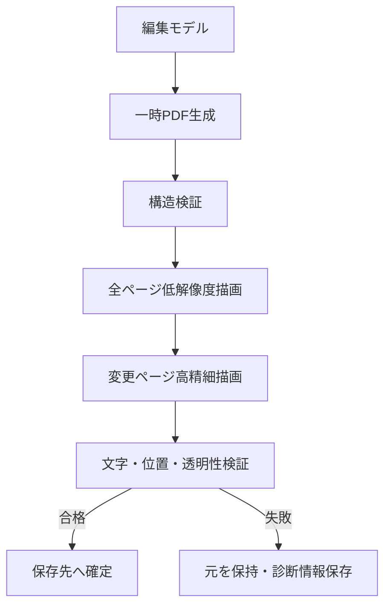

# 06-01 PDF編集仕様

## dev.133の入力注意と内部リンク

PDF読込後、PDFiumから得る暗号化・フォント情報と、最大64 MiBに制限した構造語のスキャンから、フォーム／XFA、JavaScript、埋め込みファイル、レイヤー、署名、起動アクション、増分更新、非埋め込みフォント等の注意事項を表示する。これは編集判断を助けるヒューリスティック検査であり、電子署名の真正性、PDF/A・PDF/UA適合、無害性を証明しない。

選択OCR領域に設定した内部リンクは、出力時に`/Subtype /Link`注釈と、移動先ページを直接参照する`/Dest`（`/Fit`または`/XYZ`）として追加する。既存の`/Annots`は維持する。本アプリ管理リンクには識別名を付ける。元／移動先ページや元領域を解決できないリンクは出力対象外とし、外部URI、JavaScript、Launchアクションは生成しない。

## 現行実装

dev.122では、編集プロジェクトを一時パッケージ化して別プロセスでPDFを生成し、結果を検証してから利用者指定先へ確定する経路を実装した。dev.131ではqpdf 12.4.1、PDFium 154.0.8035を使用する。PDFiumの表示・文字境界抽出・文書情報読込、PDF出力、すべてのqpdf呼出しを画面外で実行し、期限・出力量上限・プロセスツリー終了とWindowsジョブのメモリ／プロセス数制限を適用する。出力先が使用中の場合は完成済みPDFを復旧名で保持する。Windowsジョブは同一利用者権限のままであり完全なOSサンドボックスではない。下記の方式選択UI、複数エンジンによる描画比較、署名・PDF/A・Tagged PDF等の完全な入力特性判定は未実装であり、下記は引き続きVersion 1.0の目標仕様である。

dev.143では、ページ削除・並べ替え・回転を元PDFに対する論理ページ列として保存する。編集時プレビューは論理ページ番号を元ページへ写像して回転し、最終出力直前にqpdf 1回でページ選択・順序・回転を実体化する。外部ページ挿入は複数の元PDFを参照するため、その時点で単一の新しい物理元PDFへ統合する。文字送り補正用QDFはマーク位置を一度だけ索引化し、最大64 KiB周辺の命令を解析してストリーム置換するため、PDF全体のバイト配列を管理メモリへ置かない。

## 1. 対象

OCR専用オブジェクトは存在しないため、テキスト描画命令、フォント、CMap、ToUnicode、グラフィックス状態、Optional Content等を解析する。Version 1.0の主対象は`Tr=3`の不可視文字だが、透明度0、非表示レイヤー、白文字等は検出候補として分類する。

## 2. 初期表示

Catalogの`PageLayout`と`ViewerPreferences/Direction`を編集する。一般的な対応は以下。

| 綴じ | 表紙単独 | Direction | PageLayout |
|---|---|---|---|
| 左開き | あり | L2R | TwoPageRight |
| 右開き | あり | R2L | TwoPageLeft |
| 左開き | なし | L2R | TwoPageLeft |
| 右開き | なし | R2L | TwoPageRight |

ビューアが初期設定を無視する可能性をUIと文書で説明する。

dev.149では既存PDFを開く際にも同じ値を読み、編集プレビューの初期状態へ反映する。`SinglePage`は単一＋切り替え、`OneColumn`は単一＋連続、`TwoPageLeft/Right`は見開き＋切り替え、`TwoColumnLeft/Right`は見開き＋連続として扱う。`Direction`と奇数ページ側から表紙単独表示の有無を復元する。値がない場合は`SinglePage`と`L2R`を用いる。

利用者が編集プレビューを変更した場合はPDFカタログを書き換えず、任意の`EditorViewState`としてプロジェクトに保存する。プロジェクト再読込時はこの値を優先し、値のない既存プロジェクトは`ViewerSettings`へ従う。文書プロパティで初期表示を変更した場合のみ、PDF出力時に上表および連続見開き用の`TwoColumnLeft/Right`をカタログへ反映する。

## 2.1 文書情報

「文書のプロパティ」の概要タブでは、元PDFから読み取ったタイトル、作者名、主題、キーワード、作成アプリケーション、およびPDF変換ソフトを編集できる。編集値はプロジェクトへ保存し、PDF出力時にInfo辞書の`Title`、`Author`、`Subject`、`Keywords`、`Creator`、`Producer`へ反映する。空欄にした項目は出力PDFから削除する。作成日・更新日、ファイル情報、セキュリティ、フォント等の解析情報は読み取り専用とする。

## 2.2 PDFバージョン

「文書のプロパティ」の詳細設定タブに元PDFのバージョンと出力PDFのバージョンを並べて表示する。出力は自動（既定）、PDF 1.4、1.5、1.6、1.7、2.0から選択し、プロジェクトへ保存する。元PDFより低いバージョンへの変換は、上位仕様の機能を誤って残す危険があるため禁止する。PDF 1.4を明示した場合はオブジェクトストリームを無効化し、出力後の再読込検証で実際のバージョンが指定値と一致することを確認する。

## 2.3 文書の言語

「文書のプロパティ」の詳細設定タブにある読み上げオプションでは、PDFカタログの`Lang`を編集する。候補から選択するほか、BCP 47形式の任意の言語タグを入力できる。編集値はプロジェクトへ保存してPDF出力へ反映し、空欄を指定した場合は既存の`Lang`を削除する。この値は文書全体の既定言語であり、本文を翻訳したり、読み上げ音声そのものを選択したりする設定ではない。

## 3. OCRレイヤー更新方式

| 方式 | 利点 | 制約 |
|---|---|---|
| 行差し替え | 変更が小さく元構造を維持 | 命令境界・フォント・重複リスクが高い |
| 変更ページ再生成 | 構造が一貫し分割・読み順に強い | 未編集行も再生成、フォント差の可能性 |
| 全文再生成 | 全文統一・検証容易 | 時間、容量、未編集ページへの影響 |

既定は変更ページ再生成。安全な命令範囲を特定できた場合のみ行差し替えを許可する。

## 4. フォント

優先順位は、同じ既存フォント → 文書内別フォント → 利用者指定 → 既定代替フォント。サブセットに必要グリフがない、Encoding/ToUnicodeを安全に生成できない、縦書き字形を扱えない場合は再利用しない。

代替フォントはライセンスを確認し、使用グリフだけをサブセット化する。同一フォントの文字集合は可能な限り集約し、細分化による容量増を避ける。

## 5. 縦書き・回転

WritingModeと物理回転を分離する。PDF文字行列へ変換する際は、文字進行、縦用字形、句読点、縦中横、ベースラインを考慮する。出力後の抽出順と見た目を双方検証する。

## 6. 安全な保存

## 7. 入力特性

- 暗号化/権限制限: 資格情報と法的権限の範囲で扱い、編集不能なら読み取り専用。
- 電子署名: 編集により無効化されることを警告し、別名保存。
- PDF/A: 適合性喪失の可能性を明示し、適合出力は将来機能。
- Tagged PDF: 元タグを壊す可能性を評価し、保存レポートへ記載。
- 破損PDF: 読み取り専用または修復コピー経由。元を上書きしない。

## 8. 検証ルール

構文/xref/参照、ページ数、Box、描画、抽出文字、重複、制御文字、位置、回転、透明性、検索、コピー、フォント、ToUnicode、読み順を検証する。構造・描画失敗はエラー、軽微な位置差等は設定可能な警告とする。

文字単位の送り幅をPDFへ反映するとき、空白や外形を持たないUnicode要素を単独のPDFテキストオブジェクトとして測定しない。隣接する測定可能文字と同じテキストランへまとめ、文字列、空白の送り幅、配置順を維持する。編集結果が空白のみの場合は、ゼロ領域オブジェクトを生成せず元の検索文字を除去する。
